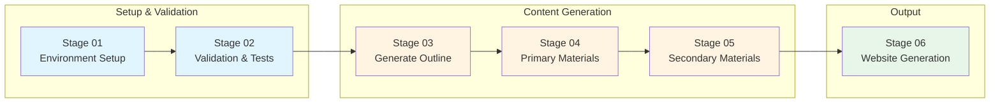
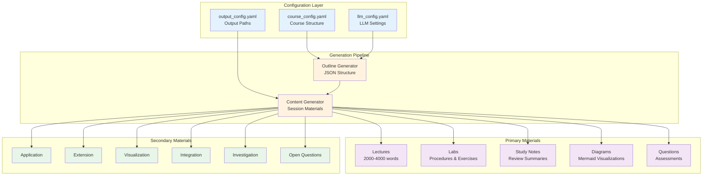
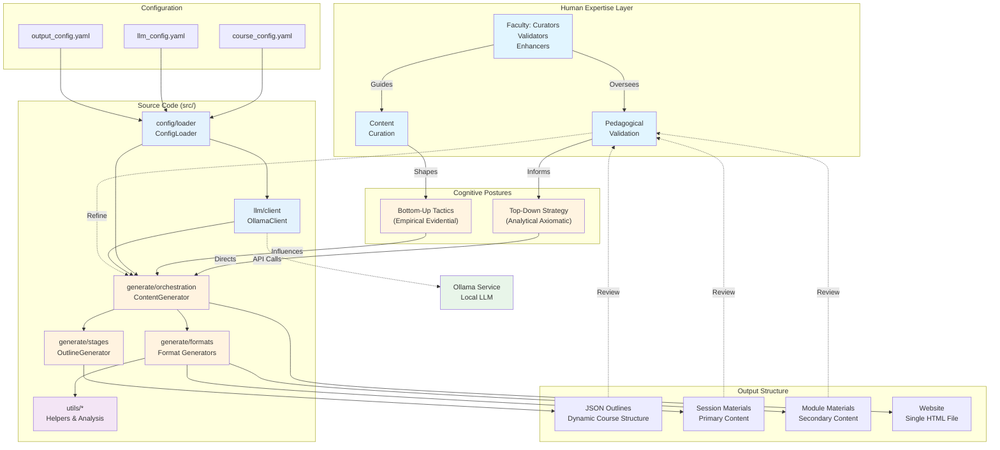

# Educational Course Generator

**Repository**: [https://github.com/docxology/curriculum](https://github.com/docxology/curriculum)

[](https://doi.org/10.5281/zenodo.17954165)

Infrastructure for creating custom, modularly configured, legibly generated curricula through the intersection of human expertise and generative AI. Faculty leverage cognitive skills and postures alongside synthetic intelligence tools to curate, validate, and enhance educational content—supporting both manual creation and AI-assisted generation workflows.

This system embodies a recursive collaboration between human judgment (top-down strategy, analytical validation) and synthetic generation (bottom-up tactics, empirical exploration), creating a nested continuum where pedagogical quality emerges through iterative refinement.

**Powered by**: Local Ollama LLM (default: `gemma3:4b`, configurable)

---

## 🚀 Quick Start

```bash
# Install dependencies
uv pip install -e ".[dev]"

# Hands-off generation (completely automated, no user interaction)
uv run python3 scripts/run_pipeline.py --no-interactive

# Or run individual stages
uv run python3 scripts/01_setup_environment.py      # Stage 01: Setup
uv run python3 scripts/02_run_tests.py              # Stage 02: Testing
uv run python3 scripts/03_generate_outline.py --no-interactive  # Stage 03: Outline
uv run python3 scripts/04_generate_primary.py       # Stage 04: Primary content
uv run python3 scripts/05_generate_secondary.py     # Stage 05: Secondary content
uv run python3 scripts/06_website.py               # Stage 06: Website
```

**Requirements**: Python 3.10+, [uv](https://github.com/astral-sh/uv), [Ollama](https://ollama.ai/) with model

---

## 📊 System Overview

### Pipeline Workflow



### Content Generation Flow



### System Architecture



---

## 🎯 Key Features

### Generated Content

**5 Primary Materials** (per session):
- 📚 **Lectures** - Comprehensive instructional content (2000-4000 words)
- 🔬 **Labs** - Laboratory exercises with procedures
- 📝 **Study Notes** - Concise review summaries
- 📊 **Diagrams** - Mermaid visualizations
- ❓ **Questions** - Multiple choice, short answer, essay assessments

**6 Secondary Materials** (per session):
- 🔧 Application, Extension, Visualization, Integration, Investigation, Open Questions

### Core Principles

- ✅ **Implementations only** - No mocks in tests (~540 tests across 25 files)
- ✅ **Configuration-driven** - YAML controls all behavior
- ✅ **Text-based** - All formats human-editable and git-friendly
- ✅ **Modular design** - Clear separation of concerns
- ✅ **Safe-to-fail** - Graceful error handling throughout

---

## 📁 Project Structure

```
curriculum/
├── src/                    # Source code (modular)
│   ├── config/             # Configuration management
│   ├── llm/                # Ollama LLM client
│   ├── generate/           # Content generation
│   │   ├── orchestration/  # Pipeline coordination
│   │   ├── stages/         # Generation stages
│   │   ├── processors/     # Content processing
│   │   └── formats/        # Format generators
│   ├── utils/              # Utilities
│   └── website/            # Website generation
├── config/                 # YAML configurations
│   ├── course_config.yaml
│   ├── llm_config.yaml
│   └── output_config.yaml
├── scripts/                # Executable scripts (7 scripts)
│   ├── 01_setup_environment.py
│   ├── 02_run_tests.py
│   ├── 03_generate_outline.py
│   ├── 04_generate_primary.py
│   ├── 05_generate_secondary.py
│   ├── 06_website.py
│   └── run_pipeline.py
├── tests/                  # Test suite (~540 tests, NO MOCKS)
├── docs/                   # Comprehensive documentation (18+ files)
└── output/                 # Generated content (gitignored)
    ├── outlines/           # JSON course outlines
    ├── {course_name}/      # Course-specific output
    │   ├── outlines/       # Course-specific outlines
    │   ├── modules/        # Session-based materials
    │   └── website/        # Generated website
    └── website/            # Default website location
```

---

## 🛠️ Common Commands

| Task | Command |
|------|---------|
| **Setup** | `uv pip install -e ".[dev]"` |
| **Hands-off full pipeline** | `uv run python3 scripts/run_pipeline.py --no-interactive` |
| **Full pipeline (interactive)** | `uv run python3 scripts/run_pipeline.py` |
| **Generate outline** | `uv run python3 scripts/03_generate_outline.py --no-interactive` |
| **Generate primary content** | `uv run python3 scripts/04_generate_primary.py` |
| **Specific modules** | `uv run python3 scripts/04_generate_primary.py --modules 1 2 3` |
| **Generate secondary content** | `uv run python3 scripts/05_generate_secondary.py` |
| **Dry-run mode** | `uv run python3 scripts/05_generate_secondary.py --modules 1 --dry-run` |
| **Generate website** | `uv run python3 scripts/06_website.py --open-browser` |
| **Run tests** | `uv run pytest` |
| **Test with coverage** | `uv run pytest --cov=src` |

---

## 📚 Documentation

### Getting Started

- **[SETUP.md](SETUP.md)** - Installation, prerequisites, quick test, troubleshooting

### Essential Reading

- **[docs/ARCHITECTURE.md](docs/ARCHITECTURE.md)** - System design, modules, data flow, extension points
- **[docs/PIPELINE_GUIDE.md](docs/PIPELINE_GUIDE.md)** - Complete 6-stage pipeline documentation, workflows, troubleshooting
- **[docs/CONFIGURATION.md](docs/CONFIGURATION.md)** - Complete YAML configuration reference, validation rules
- **[docs/JSON_OUTLINE.md](docs/JSON_OUTLINE.md)** - JSON outline format, lifecycle, discovery mechanism

### Content & Output

- **[docs/FORMATS.md](docs/FORMATS.md)** - All content formats (lectures, labs, diagrams, questions, study notes)
- **[docs/API.md](docs/API.md)** - Complete public API reference for all modules

### Testing & Quality

- **[docs/TESTING_COVERAGE.md](docs/TESTING_COVERAGE.md)** - Test suite coverage, statistics, and guidelines

### Troubleshooting

- **[docs/TROUBLESHOOTING.md](docs/TROUBLESHOOTING.md)** - Comprehensive troubleshooting guide
- **[src/llm/TROUBLESHOOTING.md](src/llm/TROUBLESHOOTING.md)** - LLM-specific troubleshooting

### For Developers

- **[AGENTS.md](AGENTS.md)** - For AI agents: architecture, common tasks, code standards
- **[docs/CONTRIBUTING.md](docs/CONTRIBUTING.md)** - Contribution guidelines and development workflow
- **[.cursorrules/README.md](.cursorrules/README.md)** - Development rules (environment, testing, logging, error handling)

### Complete Documentation Index

- **[docs/README.md](docs/README.md)** - Complete documentation index with navigation guide

---

## 🔄 Hands-Off Execution

For complete automation (CI/CD, scripts, no user interaction):

```bash
# Full pipeline, zero interaction required
uv run python3 scripts/run_pipeline.py --no-interactive

# Skip validation, just generate
uv run python3 scripts/run_pipeline.py --no-interactive --skip-setup --skip-validation

# Generate specific modules only
uv run python3 scripts/run_pipeline.py --no-interactive --modules 1 2 3
```

**Key flag**: `--no-interactive` makes Stage 03 (outline generation) use config defaults instead of prompting.

---

## 📖 Citation & Archival

This repository is archived at Zenodo for long-term preservation and citation:

- **DOI**: [10.5281/zenodo.17954165](https://doi.org/10.5281/zenodo.17954165)
- **Zenodo Archive**: [https://zenodo.org/records/17954165](https://zenodo.org/records/17954165)

When citing this work, please use the DOI above.

---

## 📄 License

This work is licensed under the [Creative Commons Attribution-NonCommercial-NoDerivatives 4.0 International License](https://creativecommons.org/licenses/by-nc-nd/4.0/).

To view a copy of this license, visit https://creativecommons.org/licenses/by-nc-nd/4.0/
