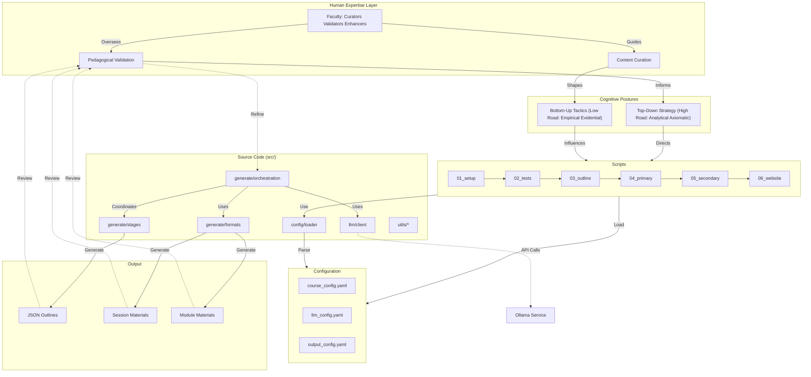

# Educational Course Generator

**Repository**: [https://github.com/docxology/curriculum](https://github.com/docxology/curriculum)

Infrastructure for creating custom, modularly configured, legibly generated curricula through the intersection of human expertise and generative AI. Faculty leverage cognitive skills and postures alongside synthetic intelligence tools to curate, validate, and enhance educational content—supporting both manual creation and AI-assisted generation workflows.

This system embodies a recursive collaboration between human judgment (top-down strategy, analytical validation) and synthetic generation (bottom-up tactics, empirical exploration), creating a nested continuum where pedagogical quality emerges through iterative refinement. The balance between what *ought* to be taught and what *is* effectively learnable is continuously negotiated through faculty oversight and AI capability.

Powered by local Ollama LLM (default: gemma3:4b, configurable).

## Quick Start

```bash
# Install dependencies
uv pip install -e ".[dev]"

# Hands-off generation (completely automated, no user interaction)
uv run python3 scripts/run_pipeline.py --no-interactive

# Or run individual stages
uv run python3 scripts/01_setup_environment.py      # Stage 01: Setup
uv run python3 scripts/02_run_tests.py  # Stage 02: Testing (runs by default)
uv run python3 scripts/03_generate_outline.py --no-interactive  # Stage 03: Outline (non-interactive)
uv run python3 scripts/04_generate_primary.py       # Stage 04: Primary (auto-finds outline, all modules)
uv run python3 scripts/05_generate_secondary.py     # Stage 05: Secondary (auto-finds outline, all modules)
uv run python3 scripts/06_website.py                # Stage 06: Website (auto-finds outline, creates HTML)

# Run tests
uv run pytest
```

## Hands-Off Execution

For complete automation (CI/CD, scripts, no user interaction):

```bash
# Full pipeline, zero interaction required
uv run python3 scripts/run_pipeline.py --no-interactive

# Skip validation, just generate
uv run python3 scripts/run_pipeline.py --no-interactive --skip-setup --skip-validation

# Generate specific modules only
uv run python3 scripts/run_pipeline.py --no-interactive --modules 1 2 3
```

**Key flag**: `--no-interactive` makes Stage 03 (outline generation) use config defaults instead of prompting.

## Documentation Map

### Repository
- **[GitHub Repository](https://github.com/docxology/curriculum)** - Source code, issues, and contributions

### Getting Started
- **[SETUP.md](SETUP.md)** - Installation, prerequisites, quick test, troubleshooting

### Essential Reading
- **[docs/ARCHITECTURE.md](docs/ARCHITECTURE.md)** - System design, modules, data flow, extension points
- **[docs/PIPELINE_GUIDE.md](docs/PIPELINE_GUIDE.md)** - Pipeline stages, scripts reference, workflows, error handling
- **[docs/CONFIGURATION.md](docs/CONFIGURATION.md)** - Complete YAML configuration reference
- **[docs/JSON_OUTLINE.md](docs/JSON_OUTLINE.md)** - JSON outline format, generation, and consumption

### Content & Output
- **[docs/FORMATS.md](docs/FORMATS.md)** - All content formats (lectures, labs, diagrams, questions, study notes)
- **[docs/API.md](docs/API.md)** - Complete public API reference for all modules

### Testing & Quality
- **[docs/TESTING_COVERAGE.md](docs/TESTING_COVERAGE.md)** - Test suite coverage, statistics, and guidelines

### Troubleshooting
- **[docs/TROUBLESHOOTING.md](docs/TROUBLESHOOTING.md)** - Comprehensive troubleshooting guide

### For Developers
- **[AGENTS.md](AGENTS.md)** - For AI agents: architecture, common tasks, code standards
- **[docs/CONTRIBUTING.md](docs/CONTRIBUTING.md)** - Contribution guidelines and development workflow
- **[.cursorrules/README.md](.cursorrules/README.md)** - Development rules (environment, testing, logging, error handling)

### Complete Documentation
- **[docs/README.md](docs/README.md)** - Complete documentation index with navigation guide

## System Architecture



## Project Structure

```
curriculum/
├── src/        # Source code (modular)
│   ├── config/           # Configuration management
│   ├── llm/              # Ollama LLM client
│   ├── generate/         # Content generation
│   │   ├── orchestration/  # Pipeline coordination
│   │   ├── stages/         # Generation stages
│   │   ├── processors/     # Content processing
│   │   └── formats/        # Format generators
│   ├── setup/            # Initialization
│   ├── utils/            # Utilities
│   └── website/          # Website generation
├── config/               # YAML configurations
│   ├── course_config.yaml
│   ├── llm_config.yaml
│   └── output_config.yaml
├── scripts/              # Executable scripts (7 scripts)
│   ├── 01_setup_environment.py
│   ├── 02_run_tests.py
│   ├── 03_generate_outline.py
│   ├── 04_generate_primary.py
│   ├── 05_generate_secondary.py
│   ├── 06_website.py
│   └── run_pipeline.py
├── tests/                # Test suite (~540 tests across 25 files, NO MOCKS)
├── docs/                 # Comprehensive documentation (18+ files)
└── output/               # Generated content (gitignored)
    ├── outlines/         # JSON course outlines (dynamically generated, default location)
    ├── {course_name}/    # Course-specific output directories
    │   ├── outlines/     # Course-specific outlines
    │   ├── modules/      # Session-based course materials
    │   └── website/      # Generated website (single HTML)
    └── website/          # Default website location (fallback)
```

## Key Commands

| Task | Command |
|------|---------|
| **Setup** | `uv pip install -e ".[dev]"` |
| **Hands-off full pipeline** | `uv run python3 scripts/run_pipeline.py --no-interactive` |
| **Full pipeline (interactive)** | `uv run python3 scripts/run_pipeline.py` |
| **Generate outline (interactive)** | `uv run python3 scripts/03_generate_outline.py` |
| **Generate outline (hands-off)** | `uv run python3 scripts/03_generate_outline.py --no-interactive` |
| **Generate primary content** | `uv run python3 scripts/04_generate_primary.py` (auto-finds latest outline, all modules) |
| **Specific modules** | `uv run python3 scripts/04_generate_primary.py --modules 1 2 3` |
| **Use specific outline** | `uv run python3 scripts/04_generate_primary.py --outline path.json` |
| **Generate secondary content** | `uv run python3 scripts/05_generate_secondary.py` (auto-finds latest outline, all modules) |
| **Dry-run mode** | `uv run python3 scripts/05_generate_secondary.py --modules 1 --dry-run` |
| **Run tests** | `uv run pytest` |
| **Test with coverage** | `uv run pytest --cov=src` |
| **Format code** | `uv run black src/ tests/` |
| **Type check** | `uv run mypy src/` |

## Generated Content

The system generates **5 primary content formats** per session:

1. **Lectures** - Comprehensive instructional content (2000-4000 words)
2. **Labs** - Laboratory exercises with procedures
3. **Study Notes** - Concise review summaries
4. **Diagrams** - Mermaid visualizations
5. **Questions** - Multiple choice, short answer, essay assessments

Plus **6 secondary material types** per module:
- Application, Extension, Visualization, Integration, Investigation, Open Questions

See **[docs/FORMATS.md](docs/FORMATS.md)** for complete details.

## Core Principles

- **Implementations only** - No mocks in tests
- **Configuration-driven** - YAML controls all behavior
- **Text-based** - All formats human-editable and git-friendly
- **Modular design** - Clear separation of concerns
- **Safe-to-fail** - Graceful error handling throughout

See **[.cursorrules/README.md](.cursorrules/README.md)** for complete development standards.

## Requirements

- Python 3.10+
- [uv](https://github.com/astral-sh/uv) package manager
- [Ollama](https://ollama.ai/) with model (default: gemma3:4b, configurable in `config/llm_config.yaml`)

## License

This work is licensed under the [Creative Commons Attribution-NonCommercial-NoDerivatives 4.0 International License](https://creativecommons.org/licenses/by-nc-nd/4.0/).

To view a copy of this license, visit https://creativecommons.org/licenses/by-nc-nd/4.0/
