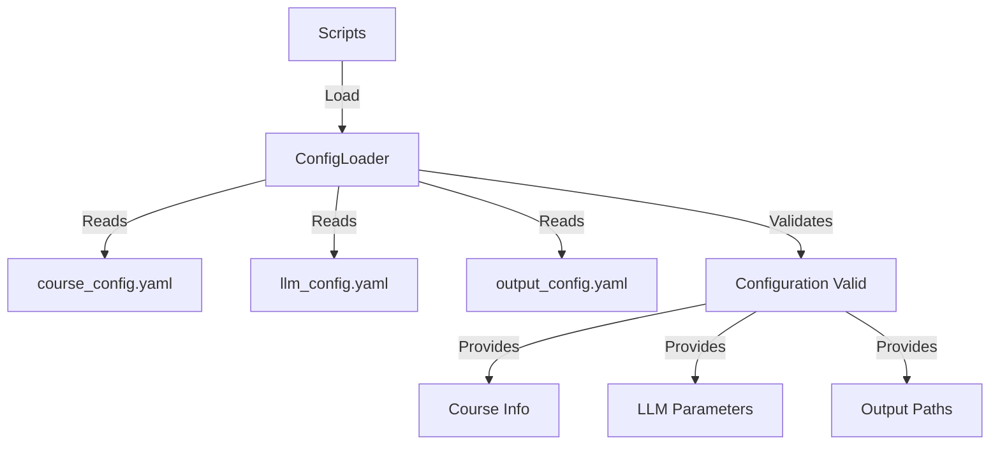
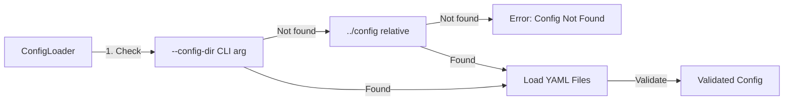
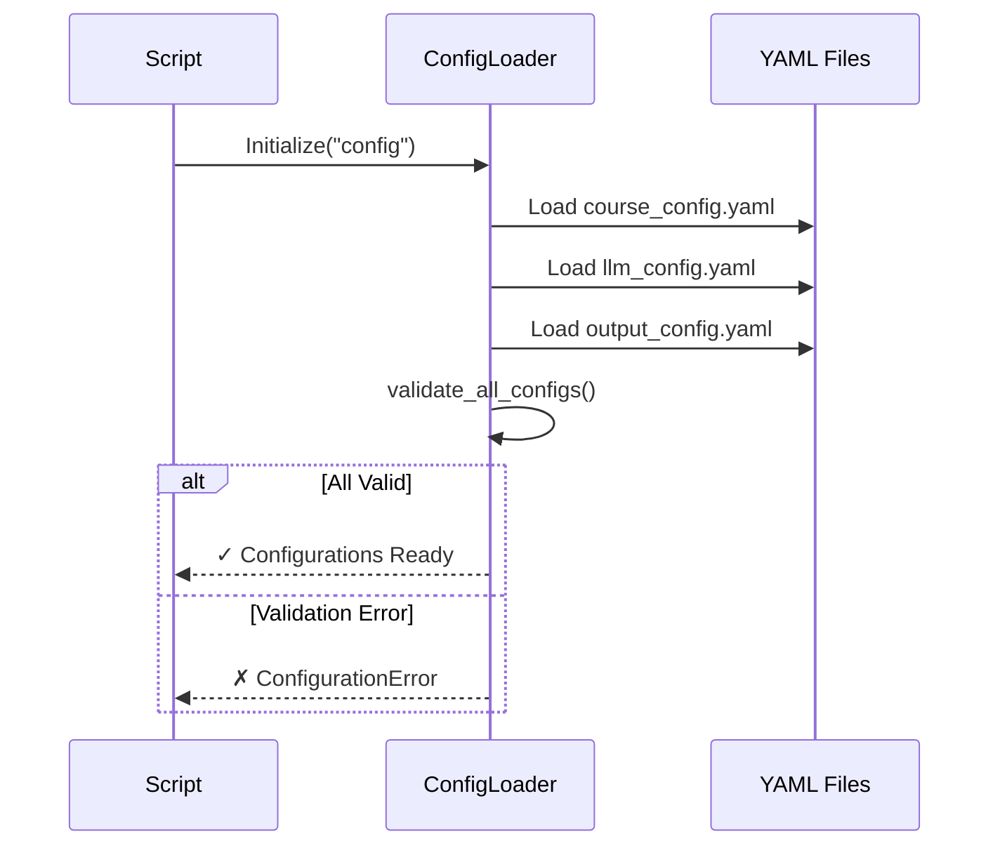

# Configuration Files

YAML configuration files that control all aspects of course generation.

## Configuration Architecture



## Multi-Location Discovery



## Files

### course_config.yaml
Defines course metadata and structure parameters for dynamic module generation.

**Contents**:
- Course metadata (name, description, level, duration)
- Configurable defaults:
  - `num_modules` - Number of modules to generate (e.g., 5, 13, 20)
  - `total_sessions` - Total class sessions across all modules
  - `sessions_per_module` - Auto-calculated if null
- Additional constraints:
  - Optional field for special requirements or topic guidance
  - LLM generates all topics based on course description and constraints

**Usage**:
```python
from src.config.loader import ConfigLoader

loader = ConfigLoader("config")
course_info = loader.get_course_info()  # Course metadata
defaults = loader.get_course_defaults()  # Structure defaults
```

### llm_config.yaml
Ollama LLM configuration and prompt templates for all content types.

**Contents**:
- LLM settings:
  - Model name (gemma3:4b)
  - API URL (http://localhost:11434/api/generate)
  - Parameters (temperature, num_predict, num_ctx, etc.)
  - Timeout settings
- Outline generation settings:
  - `items_per_field` - Configurable min/max bounds for outline fields
    - `subtopics`: min-max items per session (default: 3-7)
    - `learning_objectives`: min-max items per session (default: 3-7)
    - `key_concepts`: min-max items per session (default: 3-7)
- Prompt templates:
  - `outline` - Course outline generation
  - `lecture` - Lecture content
  - `lab` - Laboratory exercises
  - `study_notes` - Concise summaries
  - `diagram` - Mermaid diagram descriptions
  - `questions` - Assessment questions
  - `secondary_*` - Application, extension, visualization, etc.

**Usage**:
```python
from src.config.loader import ConfigLoader

loader = ConfigLoader("config")
llm_params = loader.get_llm_parameters()
lecture_template = loader.get_prompt_template("lecture")
# Returns: {"system": "...", "template": "..."}
```

### output_config.yaml
Output directory structure, file naming conventions, and logging configuration.

**Contents**:
- Base output directory
- Subdirectories for each content type
- File naming patterns
- Format specifications
- Logging configuration:
  - `heartbeat_interval`: Interval for heartbeat logs during long requests (seconds, default: 5)
  - `progress_log_interval`: Interval for stream progress updates (seconds, default: 2)

**Usage**:
```python
from src.config.loader import ConfigLoader

loader = ConfigLoader("config")
output_paths = loader.get_output_paths()
logging_intervals = loader.get_logging_intervals()
# Returns: {"heartbeat_interval": 5.0, "progress_log_interval": 2.0}
```

## Validation Flow



## Configuration Validation

The `ConfigLoader` validates all configurations on load:

```python
from src.config.loader import ConfigLoader, ConfigurationError

try:
    loader = ConfigLoader("config")
    loader.validate_all_configs()
    print("All configurations valid")
except ConfigurationError as e:
    print(f"Configuration error: {e}")
```

**Validation checks**:
- Required fields present in all configs
- Course has required metadata (name, description, level)
- Defaults are properly formatted (num_modules and total_sessions are positive integers)
- LLM config has model and prompts sections
- Output config has output directory specification

## Quick Reference

| Config | Primary Purpose | Key Sections |
|--------|----------------|--------------|
| `course_config.yaml` | Course content structure | course, modules |
| `llm_config.yaml` | LLM settings and prompts | llm, prompts |
| `output_config.yaml` | Output organization | output |

## Modifying Configurations

### Adjusting Course Structure

Edit `course_config.yaml` to change module/session structure:
```yaml
course:
  defaults:
    num_modules: 8           # Generate 8 modules instead of 5
    total_sessions: 24       # 24 total sessions
    sessions_per_module: null  # Auto-calculated: ~3 per module
  
  additional_constraints: "Focus on practical applications and laboratory techniques"
  # LLM will generate all topics based on course description and constraints
```

### Adding a Prompt Template

Edit `llm_config.yaml`:
```yaml
prompts:
  custom_template:
    system: "You are an expert {subject} educator."
    template: |
      Generate content for: {module_name}
      
      Subtopics:
      {subtopics}
```

### Changing Output Paths

Edit `output_config.yaml`:
```yaml
output:
  base_dir: "custom_output"
  lectures_dir: "custom_output/lectures"
```

## Validation Command

```bash
uv run python3 -c "from src.config.loader import ConfigLoader; ConfigLoader('config').validate_all_configs(); print('✓ Valid')"
```

## Documentation

- **Complete Reference**: [../docs/CONFIGURATION.md](../docs/CONFIGURATION.md)
- **Module API**: [../src/config/README.md](../src/config/README.md)
- **Usage Examples**: [../docs/ARCHITECTURE.md](../docs/ARCHITECTURE.md)

## Example Configurations

The `course_syllabus_example.yaml` file provides an alternative course structure example, demonstrating different organization patterns.

