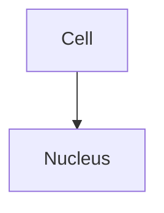

# API Reference

Complete public API reference for all educational course Generator modules.

## Quick Reference Card

| Layer | Key Class | Primary Purpose | Import Path |
|-------|-----------|----------------|-------------|
| **Configuration** | `ConfigLoader` | Load/validate YAML configs | `src.config.loader` |
| **LLM** | `OllamaClient` | Interact with Ollama API | `src.llm.client` |
| **Orchestration** | `ContentGenerator` | Pipeline coordination | `src.generate.orchestration.pipeline` |
| **Outline** | `OutlineGenerator` | Generate JSON outlines | `src.generate.stages.stage1_outline` |
| **Processing** | `OutlineParser` | Parse markdown outlines | `src.generate.processors.parser` |
| **Formats** | `LectureGenerator` | Generate lectures | `src.generate.formats.lectures` |
| **Formats** | `LabGenerator` | Generate labs | `src.generate.formats.labs` |
| **Utilities** | `helpers` module | File I/O, text processing | `src.utils.helpers` |

**Read time**: 45-60 minutes | **Audience**: Developers, integrators

## Overview

This document provides the public API for all importable modules. Use these APIs to:
- Build custom workflows
- Integrate with other systems
- Extend functionality
- Create custom generators

**Critical**: Always use modular imports from subfolders, not legacy root-level imports.

## Quick Reference

| Component | Module Path | Purpose |
|-----------|-------------|---------|
| ConfigLoader | `src.config.loader` | Load and validate YAML configs |
| OllamaClient | `src.llm.client` | Interact with Ollama LLM |
| ContentGenerator | `src.generate.orchestration.pipeline` | Main pipeline orchestration |
| OutlineGenerator | `src.generate.stages.stage1_outline` | Generate course outlines |
| OutlineParser | `src.generate.processors.parser` | Parse markdown outlines |
| ContentCleanup | `src.generate.processors.cleanup` | Clean and validate content |
| LectureGenerator | `src.generate.formats.lectures` | Generate lecture content |
| LabGenerator | `src.generate.formats.labs` | Generate lab exercises |
| StudyNotesGenerator | `src.generate.formats.study_notes` | Generate study notes |
| DiagramGenerator | `src.generate.formats.diagrams` | Generate Mermaid diagrams |
| QuestionGenerator | `src.generate.formats.questions` | Generate assessment questions |
| WebsiteGenerator | `src.website.generator` | Generate HTML website |
| Utilities | `src.utils.helpers` | File I/O and text utilities |

---

## Configuration Layer

### ConfigLoader

**Module**: `src.config.loader`

**Purpose**: Load, validate, and provide typed access to YAML configuration files.

**Import**:
```python
from src.config.loader import ConfigLoader
```

**Constructor**:
```python
ConfigLoader(config_dir: str | Path) -> ConfigLoader
```

**Parameters**:
- `config_dir`: Path to directory containing YAML config files

**Methods**:

#### `load_course_config() -> Dict[str, Any]`
Load and return course configuration from `course_config.yaml`.

**Returns**: Dictionary with course structure and module definitions

**Raises**: `ConfigurationError` if file not found or invalid YAML

#### `load_llm_config() -> Dict[str, Any]`
Load and return LLM configuration from `llm_config.yaml`.

**Returns**: Dictionary with LLM settings and prompt templates

#### `load_output_config() -> Dict[str, Any]`
Load and return output configuration from `output_config.yaml`.

**Returns**: Dictionary with output paths and formatting rules

#### `get_course_info() -> Dict[str, Any]`
Get course metadata (name, level, description, duration).

**Returns**: Dictionary with course information

#### `get_modules() -> List[Dict[str, Any]]`
Get list of all course modules with their configurations.

**Returns**: List of module dictionaries

#### `get_module_by_id(module_id: int) -> Dict[str, Any]`
Get specific module configuration by ID.

**Parameters**:
- `module_id`: Module ID number

**Returns**: Module dictionary

**Raises**: `ValueError` if module ID not found

#### `get_prompt_template(template_name: str) -> Dict[str, str]`
Get LLM prompt template by name.

**Parameters**:
- `template_name`: Name of template (`"outline"`, `"lecture"`, `"lab"`, etc.)

**Returns**: Dictionary with `"system"` and `"template"` keys

#### `get_output_paths() -> Dict[str, Any]`
Get output directory configuration.

**Returns**: Dictionary with base directory and subdirectories

#### `validate_all_configs() -> None`
Validate all configuration files.

**Raises**: `ConfigurationError` if any validation fails

**Example**:
```python
from src.config.loader import ConfigLoader

# Initialize
config = ConfigLoader("config")

# Validate
config.validate_all_configs()

# Get course info
course = config.get_course_info()
print(f"Course: {course['name']}")

# Get modules
modules = config.get_modules()
print(f"Total modules: {len(modules)}")

# Get specific module
module_1 = config.get_module_by_id(1)
print(f"Module 1: {module_1['name']}")

# Get prompt template
outline_prompt = config.get_prompt_template("outline")
print(outline_prompt["system"])
```

---

## LLM Integration Layer

### OllamaClient

**Module**: `src.llm.client`

**Purpose**: Communicate with Ollama API for text generation.

**Import**:
```python
from src.llm.client import OllamaClient
```

**Constructor**:
```python
OllamaClient(
    config: Dict[str, Any],
    max_retries: int = 3,
    retry_delay: float = 1.0
) -> OllamaClient
```

**Parameters**:
- `config`: LLM configuration dictionary with:
  - `model`: Model name (e.g., "gemma3:4b", "llama3")
  - `api_url`: Ollama API endpoint URL (default: "http://localhost:11434/api/generate")
  - `timeout`: Request timeout in seconds (default: 120)
  - `parameters`: Generation parameters (temperature, top_p, num_predict, etc.)
- `max_retries`: Maximum retry attempts (default: 3)
- `retry_delay`: Initial retry delay in seconds (default: 1.0)

**Methods**:

#### `generate(prompt: str, system_prompt: str = None, params: Dict[str, Any] = None) -> str`
Generate text from prompt.

**Parameters**:
- `prompt`: User prompt text
- `system_prompt`: Optional system prompt
- `params`: Optional generation parameters to override defaults

**Returns**: Generated text

**Raises**: `LLMError` on connection/generation failure

**Note**: Uses streaming internally for better responsiveness. Progress is logged every 5 seconds during long generations. Each request is assigned a unique request ID for tracing.

#### `generate_with_template(template: str, variables: Dict[str, Any], system_prompt: str = None, params: Dict[str, Any] = None) -> str`
Generate text using template with variable substitution.

**Parameters**:
- `template`: Prompt template with `{variable}` placeholders
- `variables`: Dictionary of values to substitute
- `system_prompt`: Optional system prompt
- `params`: Optional generation parameters

**Returns**: Generated text

**Raises**: `LLMError` on connection/generation failure

**Note**: Streaming is used internally. Request ID is assigned for tracing.

**Example**:
```python
from src.config.loader import ConfigLoader
from src.llm.client import OllamaClient

# Initialize from configuration
loader = ConfigLoader("config")
llm_config = loader.get_llm_parameters()
client = OllamaClient(llm_config)

# Simple generation
response = client.generate(
    prompt="Explain photosynthesis briefly.",
    system_prompt="You are a biology educator."
)
print(response)

# Template-based generation
template = "Explain {topic} for {level} students."
response = client.generate_with_template(
    template=template,
    variables={"topic": "mitosis", "level": "high school"},
    system_prompt="You are a biology educator."
)
print(response)

# With custom parameters
response = client.generate(
    prompt="Describe cell structure",
    params={"temperature": 0.8, "num_predict": 500}
)
```

**Request Tracing**:
Each request is assigned a unique 8-character request ID that appears in all log messages:
```
INFO: [a1b2c3d4] LLM Request: model=gemma3:4b, timeout=120s
INFO: [a1b2c3d4] Stream progress: 5.2s elapsed, 42 chunks, 1234 chars (237.3 chars/s)
INFO: [a1b2c3d4] Generation complete: 2847 chars (~569 words) in 12.5s (227.8 chars/s)
```

**Stream Timeout**:
The client tracks two timeouts:
- **Connection timeout**: Time to establish connection (configured via `timeout`)
- **Stream timeout**: Time to read complete stream (automatically `timeout * 1.5`)

Progress is logged every 5 seconds during long streams. If stream exceeds timeout, detailed diagnostic information is provided.

---

## Generation Layer

### ContentGenerator (Pipeline)

**Module**: `src.generate.orchestration.pipeline`

**Purpose**: Orchestrate full course generation workflow.

**Import**:
```python
from src.generate.orchestration.pipeline import ContentGenerator
```

**Constructor**:
```python
ContentGenerator(config_loader: ConfigLoader) -> ContentGenerator
```

**Parameters**:
- `config_loader`: Initialized ConfigLoader instance

**Methods**:

#### `stage1_generate_outline(output_dir: Path = None) -> Path`
Execute Stage 03: Generate course outline.

**Parameters**:
- `output_dir`: Optional custom output directory

**Returns**: Path to generated outline file

**Raises**: `LLMError`, `ContentGenerationError`

#### `stage2_generate_content(module_ids: List[int] = None, all_modules: bool = False) -> Dict[str, Any]`
Execute Stage 04: Generate module content.

**Parameters**:
- `module_ids`: List of specific module IDs to generate
- `all_modules`: If True, generate all modules

**Returns**: Dictionary with generation results and status

**Raises**: `LLMError`, `ContentGenerationError`

**Example**:
```python
from src.config.loader import ConfigLoader
from src.generate.orchestration.pipeline import ContentGenerator

# Initialize
config = ConfigLoader("config")
generator = ContentGenerator(config)

# Stage 03: Generate outline
outline_path = generator.stage1_generate_outline()
print(f"Outline: {outline_path}")

# Stage 04: Generate specific modules
results = generator.stage2_generate_content(module_ids=[1, 2, 3])
print(f"Generated {len(results['completed'])} modules")

# Or generate all modules
results = generator.stage2_generate_content(all_modules=True)
```

---

### OutlineGenerator

**Module**: `src.generate.stages.stage1_outline`

**Purpose**: Generate structured course outlines.

**Import**:
```python
from src.generate.stages.stage1_outline import OutlineGenerator
```

**Constructor**:
```python
OutlineGenerator(config_loader: ConfigLoader, llm_client: OllamaClient) -> OutlineGenerator
```

**Parameters**:
- `config_loader`: Initialized ConfigLoader instance
- `llm_client`: Initialized OllamaClient instance

**Methods**:

#### `generate_outline() -> str`
Generate course outline using LLM.

**Returns**: Outline as markdown string with metadata header

#### `save_outline(outline: str, output_dir: Path, filename: str = None) -> Path`
Save outline to file.

**Parameters**:
- `outline`: Outline content
- `output_dir`: Output directory
- `filename`: Optional custom filename (default: timestamped)

**Returns**: Path to saved file

#### `validate_outline(outline: str) -> bool`
Validate outline has content.

**Parameters**:
- `outline`: Outline text

**Returns**: True if valid, False otherwise

#### `generate_and_save(output_dir: Path = None) -> Path`
Generate and save outline in one operation.

**Parameters**:
- `output_dir`: Optional output directory (uses config default if None)

**Returns**: Path to saved outline file

**Example**:
```python
from src.config.loader import ConfigLoader
from src.llm.client import OllamaClient
from src.generate.stages.stage1_outline import OutlineGenerator

# Initialize
config = ConfigLoader("config")
llm_config = config.get_llm_parameters()
llm = OllamaClient(llm_config)
generator = OutlineGenerator(config, llm)

# Generate outline
outline = generator.generate_outline()
print(f"Length: {len(outline)} characters")

# Save manually
from pathlib import Path
path = generator.save_outline(outline, Path("output/outlines"))

# Or generate and save in one step
path = generator.generate_and_save()
print(f"Saved to: {path}")
```

---

### OutlineParser

**Module**: `src.generate.processors.parser`

**Purpose**: Parse markdown outlines into structured data.

**Import**:
```python
from src.generate.processors.parser import OutlineParser
```

**Constructor**:
```python
OutlineParser() -> OutlineParser
```

**Methods**:

#### `parse_outline(outline_text: str) -> List[Dict[str, Any]]`
Parse outline markdown into structured module data.

**Parameters**:
- `outline_text`: Markdown outline text

**Returns**: List of module dictionaries with extracted information

#### `extract_modules(outline_text: str) -> List[Dict[str, Any]]`
Extract module information from outline.

**Parameters**:
- `outline_text`: Markdown outline text

**Returns**: List of dictionaries with module metadata

#### `extract_metadata(outline_text: str) -> Dict[str, str]`
Extract header metadata from outline.

**Parameters**:
- `outline_text`: Markdown outline text

**Returns**: Dictionary with course metadata (level, duration, etc.)

**Example**:
```python
from src.generate.processors.parser import OutlineParser
from pathlib import Path

# Read outline
outline_text = Path("output/outlines/course_outline.md").read_text()

# Parse
parser = OutlineParser()
modules = parser.parse_outline(outline_text)

# Process results
for module in modules:
    print(f"Module {module['id']}: {module['name']}")
    print(f"  Subtopics: {len(module['subtopics'])}")
    print(f"  Objectives: {len(module['objectives'])}")

# Extract just metadata
metadata = parser.extract_metadata(outline_text)
print(f"Course level: {metadata.get('level')}")
```

---

## Processing Layer (Continued)

### ContentCleanup

**Module**: `src.generate.processors.cleanup`

**Purpose**: Post-generation content cleanup and validation utilities.

**Import**:
```python
from src.generate.processors.cleanup import (
    clean_conversational_artifacts,
    standardize_placeholders,
    remove_word_count_statements,
    clean_content,
    validate_content
)
```

**Functions**:

#### `clean_conversational_artifacts(content: str) -> str`
Remove conversational phrases from LLM-generated content.

**Parameters**:
- `content`: Raw content from LLM

**Returns**: Cleaned content with conversational artifacts removed

**Removes**: Phrases like "Okay, here's...", "Would you like...", "Let me know..."

#### `standardize_placeholders(content: str) -> str`
Replace specific names and dates with placeholders.

**Parameters**:
- `content`: Content with specific references

**Returns**: Content with standardized placeholders

**Replacements**:
- Instructor names → `[INSTRUCTOR]`
- Specific dates → `[DATE]`

#### `remove_word_count_statements(content: str) -> str`
Remove LLM-generated word count statements.

**Parameters**:
- `content`: Content that may contain word count statements

**Returns**: Content with word count statements removed

#### `clean_content(content: str) -> str`
Apply all cleanup functions to content.

**Parameters**:
- `content`: Raw LLM-generated content

**Returns**: Fully cleaned content

**Example**:
```python
from src.generate.processors.cleanup import clean_content

raw_content = "Okay, here's the lecture. Dr. Smith will teach this on Oct 26, 2023..."
cleaned = clean_content(raw_content)
# Result: "The lecture. [INSTRUCTOR] will teach this on [DATE]..."
```

---

## Format Generators

### LectureGenerator

**Module**: `src.generate.formats.lectures`

**Purpose**: Generate comprehensive lecture content.

**Import**:
```python
from src.generate.formats.lectures import LectureGenerator
```

**Constructor**:
```python
LectureGenerator(llm_client: OllamaClient, config_loader: ConfigLoader) -> LectureGenerator
```

**Methods**:

#### `generate_lecture(module_info: Dict[str, Any]) -> str`
Generate lecture content for a module.

**Parameters**:
- `module_info`: Module configuration dictionary

**Returns**: Lecture content as markdown

#### `save_lecture(lecture: str, module_info: Dict[str, Any], output_dir: Path) -> Path`
Save lecture to file.

**Parameters**:
- `lecture`: Lecture content
- `module_info`: Module configuration
- `output_dir`: Output directory (session directory path)

**Returns**: Path to saved file

**Example**:
```python
from src.config.loader import ConfigLoader
from src.llm.client import OllamaClient
from src.generate.formats.lectures import LectureGenerator
from pathlib import Path

# Initialize
config = ConfigLoader("config")
llm = OllamaClient()
generator = LectureGenerator(llm, config)

# Get module
module = config.get_module_by_id(1)

# Generate lecture
lecture = generator.generate_lecture(module)
print(f"Generated {len(lecture)} characters")

# Save (session-based structure)
session_dir = Path("output/modules/module_01_cell_biology/session_01")
session_dir.mkdir(parents=True, exist_ok=True)
path = generator.save_lecture(
    lecture, 
    module, 
    session_dir
)
print(f"Saved to: {path}")
```

---

### LabGenerator

**Module**: `src.generate.formats.labs`

**Purpose**: Generate laboratory exercise procedures.

**Import**:
```python
from src.generate.formats.labs import LabGenerator
```

**Constructor**:
```python
LabGenerator(llm_client: OllamaClient, config_loader: ConfigLoader) -> LabGenerator
```

**Methods**:

#### `generate_lab(module_info: Dict[str, Any], lab_num: int = 1, focus: str = None) -> str`
Generate lab exercise for a module.

**Parameters**:
- `module_info`: Module configuration dictionary
- `lab_num`: Lab number
- `focus`: Optional specific focus topic (uses subtopic if None)

**Returns**: Lab content as markdown

#### `save_lab(lab: str, module_info: Dict[str, Any], lab_number: int, output_dir: Path) -> Path`
Save lab to file.

**Parameters**:
- `lab`: Lab content
- `module_info`: Module configuration
- `lab_number`: Lab number
- `output_dir`: Output directory (session directory path)

**Returns**: Path to saved file

**Example**:
```python
from src.generate.formats.labs import LabGenerator

# Initialize
generator = LabGenerator(llm_client, config_loader)
module = config.get_module_by_id(1)

# Generate lab with specific focus
lab = generator.generate_lab(
    module, 
    lab_num=1, 
    focus="Microscopy techniques"
)

# Save (session-based structure)
session_dir = Path("output/modules/module_01_cell_biology/session_01")
session_dir.mkdir(parents=True, exist_ok=True)
path = generator.save_lab(lab, module, lab_num=1, output_dir=session_dir)
```

---

### StudyNotesGenerator

**Module**: `src.generate.formats.study_notes`

**Purpose**: Generate concise study summaries.

**Import**:
```python
from src.generate.formats.study_notes import StudyNotesGenerator
```

**Constructor**:
```python
StudyNotesGenerator(llm_client: OllamaClient, config_loader: ConfigLoader) -> StudyNotesGenerator
```

**Methods**:

#### `generate_study_notes(module_info: Dict[str, Any]) -> str`
Generate study notes for a module.

**Parameters**:
- `module_info`: Module configuration dictionary

**Returns**: Study notes as markdown

#### `save_study_notes(notes: str, module_info: Dict[str, Any], output_dir: Path) -> Path`
Save study notes to file.

**Parameters**:
- `notes`: Study notes content
- `module_info`: Module configuration
- `output_dir`: Output directory

**Returns**: Path to saved file

**Example**:
```python
from src.generate.formats.study_notes import StudyNotesGenerator

generator = StudyNotesGenerator(llm_client, config_loader)
notes = generator.generate_study_notes(module)
# Save (session-based structure)
session_dir = Path("output/modules/module_01_cell_biology/session_01")
session_dir.mkdir(parents=True, exist_ok=True)
path = generator.save_study_notes(notes, module, session_dir)
```

---

### DiagramGenerator

**Module**: `src.generate.formats.diagrams`

**Purpose**: Generate Mermaid diagram code.

**Import**:
```python
from src.generate.formats.diagrams import DiagramGenerator
```

**Constructor**:
```python
DiagramGenerator(llm_client: OllamaClient, config_loader: ConfigLoader) -> DiagramGenerator
```

**Methods**:

#### `generate_diagram(topic: str, context: str, diagram_num: int = 1) -> str`
Generate Mermaid diagram code.

**Parameters**:
- `topic`: Diagram topic/title
- `context`: Additional context for generation
- `diagram_num`: Diagram number

**Returns**: Mermaid code (cleaned, no markdown fences)

#### `save_diagram(diagram: str, topic: str, module_id: int, diagram_num: int, output_dir: Path) -> Path`
Save diagram to .mmd file.

**Parameters**:
- `diagram`: Mermaid code
- `topic`: Diagram topic
- `module_id`: Module ID
- `diagram_num`: Diagram number
- `output_dir`: Output directory (session directory path)

**Returns**: Path to saved .mmd file

**Example**:
```python
from src.generate.formats.diagrams import DiagramGenerator

generator = DiagramGenerator(llm_client, config_loader)

# Generate diagram
diagram = generator.generate_diagram(
    topic="Cell Division Process",
    context="Show the stages of mitosis",
    diagram_num=1
)

# Save
# Save (session-based structure)
session_dir = Path("output/modules/module_01_cell_biology/session_01")
session_dir.mkdir(parents=True, exist_ok=True)
path = generator.save_diagram(
    diagram,
    "cell_division",
    module_id=module['module_id'],
    diagram_num=1,
    output_dir=session_dir
)
```

---

### QuestionGenerator

**Module**: `src.generate.formats.questions`

**Purpose**: Generate assessment questions (MC, SA, Essay).

**Import**:
```python
from src.generate.formats.questions import QuestionGenerator
```

**Constructor**:
```python
QuestionGenerator(llm_client: OllamaClient, config_loader: ConfigLoader) -> QuestionGenerator
```

**Methods**:

#### `generate_questions(module_info: Dict[str, Any]) -> str`
Generate comprehension questions for a module.

**Parameters**:
- `module_info`: Module configuration dictionary

**Returns**: Questions as markdown (distributed as 50% MC, 30% SA, 20% Essay)

#### `save_questions(questions: str, module_info: Dict[str, Any], output_dir: Path) -> Path`
Save questions to file.

**Parameters**:
- `questions`: Questions content
- `module_info`: Module configuration
- `output_dir`: Output directory

**Returns**: Path to saved file

**Example**:
```python
from src.generate.formats.questions import QuestionGenerator

generator = QuestionGenerator(llm_client, config_loader)

# Module specifies num_questions: 20
module = config.get_module_by_id(1)

# Generate (automatically distributes: 10 MC, 6 SA, 4 Essay)
questions = generator.generate_questions(module)

# Save (session-based structure)
session_dir = Path("output/modules/module_01_cell_biology/session_01")
session_dir.mkdir(parents=True, exist_ok=True)
path = generator.save_questions(questions, module, session_dir)
```

---

## Website Generation Layer

### WebsiteGenerator

**Module**: `src.website.generator`

**Purpose**: Generate single HTML website from course materials.

**Import**:
```python
from src.website.generator import WebsiteGenerator
```

**Constructor**:
```python
WebsiteGenerator(config_loader: ConfigLoader) -> WebsiteGenerator
```

**Parameters**:
- `config_loader`: Initialized ConfigLoader instance

**Methods**:

#### `generate(outline_path: Optional[Path] = None, output_path: Optional[Path] = None) -> Path`
Generate the website HTML file.

**Parameters**:
- `outline_path`: Optional path to specific outline JSON file
- `output_path`: Optional path for output HTML file

**Returns**: Path to generated HTML file

**Raises**: `FileNotFoundError` if outline not found, `ValueError` if no modules

**Example**:
```python
from src.config.loader import ConfigLoader
from src.website.generator import WebsiteGenerator
from pathlib import Path

config = ConfigLoader("config")
generator = WebsiteGenerator(config)

# Generate website (auto-discovers outline and content)
html_path = generator.generate()
print(f"Website saved to: {html_path}")

# Use specific outline
html_path = generator.generate(
    outline_path=Path("output/outlines/course_outline_20241208.json")
)
```

---

## Utility Layer

### Helpers

**Module**: `src.utils.helpers`

**Purpose**: File I/O and text processing utilities.

**Import**:
```python
from src.utils.helpers import (
    ensure_directory,
    save_markdown,
    load_markdown,
    slugify,
    format_timestamp
)
```

**Functions**:

#### `ensure_directory(path: Path) -> None`
Create directory and parents if they don't exist.

**Parameters**:
- `path`: Directory path to create

#### `save_markdown(content: str, filepath: Path) -> None`
Save markdown content to file.

**Parameters**:
- `content`: Markdown text
- `filepath`: Destination file path

#### `load_markdown(filepath: Path) -> str`
Load markdown content from file.

**Parameters**:
- `filepath`: Source file path

**Returns**: Markdown text

#### `slugify(text: str) -> str`
Convert text to URL-safe slug.

**Parameters**:
- `text`: Text to slugify

**Returns**: Slugified string (lowercase, spaces→underscores, special chars removed)

#### `format_timestamp() -> str`
Get current timestamp in YYYYMMDD_HHMMSS format.

**Returns**: Timestamp string

**Example**:
```python
from src.utils.helpers import (
    ensure_directory,
    save_markdown,
    slugify,
    format_timestamp
)
from pathlib import Path

# Ensure directory exists
output_dir = Path("output/custom")
ensure_directory(output_dir)

# Create filename
title = "Cell Biology: Introduction"
slug = slugify(title)  # "cell_biology_introduction"
timestamp = format_timestamp()  # "20241208_143022"
filename = f"{slug}_{timestamp}.md"

# Save content
content = "# Cell Biology\n\nIntroduction to cells..."
save_markdown(content, output_dir / filename)
```

---

### Content Analysis

**Module**: `src.utils.content_analysis`

Content analysis functions validate and assess generated content quality.

#### `analyze_lecture(lecture_text: str, requirements: Dict[str, int] = None) -> Dict[str, Any]`

Analyze lecture content for quality metrics.

**Parameters**:
- `lecture_text`: Lecture content in markdown
- `requirements`: Optional dict with min_word_count, max_word_count, min_examples, max_examples, min_sections, max_sections

**Returns**: Dictionary with:
- `word_count`: Number of words
- `char_count`: Number of characters
- `sections`: Number of major sections (## headings)
- `subsections`: Number of subsections (### headings)
- `examples`: Number of examples detected
- `terms`: Number of terms defined
- `warnings`: List of validation warnings
- `requirements`: Requirements used for validation

**Example**:
```python
from src.utils.content_analysis import analyze_lecture

lecture = "# Module 1\n\n## Introduction\n\n..."
requirements = {
    'min_word_count': 1000,
    'max_word_count': 1500,
    'min_examples': 5,
    'max_examples': 15
}
metrics = analyze_lecture(lecture, requirements=requirements)

print(f"Words: {metrics['word_count']}")
print(f"Sections: {metrics['sections']}")
if metrics['warnings']:
    print(f"Warnings: {metrics['warnings']}")
```

#### `analyze_questions(questions_text: str) -> Dict[str, Any]`

Analyze questions content for completeness.

**Parameters**:
- `questions_text`: Questions content in markdown

**Returns**: Dictionary with:
- `word_count`: Number of words
- `char_count`: Number of characters
- `total_questions`: Number of questions detected
- `mc_questions`: Number of multiple choice questions
- `answers_provided`: Number of answers found
- `explanations_provided`: Number of explanations found
- `warnings`: List of validation warnings

**Supported Question Formats**:
- `**Question 1:**` (with colon) - Preferred format
- `**Question 1**` (without colon)
- `## Question 1` (markdown heading)
- `1.` or `1)` (numbered list with question mark)

**Example**:
```python
from src.utils.content_analysis import analyze_questions

questions = """
**Question 1:** What is a cell?
A) Basic unit of life
B) Organ
**Answer:** A
**Explanation:** Cells are the fundamental units...

**Question 2:** Describe mitosis.
**Answer:** Mitosis is cell division...
"""

metrics = analyze_questions(questions)
print(f"Total questions: {metrics['total_questions']}")
print(f"Answers: {metrics['answers_provided']}")
if metrics['warnings']:
    print(f"Warnings: {metrics['warnings']}")
```

#### `analyze_study_notes(notes_text: str, requirements: Dict[str, int] = None) -> Dict[str, Any]`

Analyze study notes content for quality.

**Parameters**:
- `notes_text`: Study notes content in markdown
- `requirements`: Optional dict with min_key_concepts, max_key_concepts, max_word_count

**Returns**: Dictionary with:
- `word_count`: Number of words
- `char_count`: Number of characters
- `sections`: Number of sections
- `key_concepts`: Number of key concepts highlighted
- `bullet_points`: Number of bullet points
- `tables`: Number of tables
- `warnings`: List of validation warnings
- `requirements`: Requirements used for validation

**Example**:
```python
from src.utils.content_analysis import analyze_study_notes

notes = """
# Study Notes

## Key Concepts

- **Cell Theory**: All living things...
- **Organelles**: Specialized structures...
"""

requirements = {
    'min_key_concepts': 3,
    'max_key_concepts': 10,
    'max_word_count': 1200
}
metrics = analyze_study_notes(notes, requirements=requirements)

print(f"Key concepts: {metrics['key_concepts']}")
if metrics['warnings']:
    print(f"Warnings: {metrics['warnings']}")
```

#### `log_content_metrics(content_type: str, metrics: Dict[str, Any], logger_obj: logging.Logger = None) -> None`

Log content analysis metrics with validation status.

**Parameters**:
- `content_type`: Type of content (lecture, lab, questions, study_notes, etc.)
- `metrics`: Metrics dictionary from analyze_* functions
- `logger_obj`: Optional logger (defaults to module logger)

**Output**: Logs validation status ([COMPLIANT] or [NEEDS REVIEW]) with detailed metrics

**Example**:
```python
from src.utils.content_analysis import (
    analyze_lecture,
    log_content_metrics
)
import logging

logger = logging.getLogger(__name__)
lecture = "# Module 1\n\n..."
metrics = analyze_lecture(lecture)
log_content_metrics("lecture", metrics, logger)
# Output:
# ✓ Lecture generated: [COMPLIANT]
#   - Length: 7002 chars, 1022 words
#   - Structure: 7 sections, 0 subsections
#   - Content: 11 examples, 11 terms defined
```

#### `validate_mermaid_syntax(diagram: str) -> Tuple[str, List[str]]`

Validate and clean Mermaid diagram syntax.

**Parameters**:
- `diagram`: Mermaid diagram code

**Returns**: Tuple of (cleaned_diagram, list_of_warnings)

**Example**:
```python
from src.utils.content_analysis import validate_mermaid_syntax

diagram = """

"""

cleaned, warnings = validate_mermaid_syntax(diagram)
if warnings:
    print(f"Warnings: {warnings}")
# cleaned diagram has code fences removed
```

**Complete Example**:
```python
from src.utils.content_analysis import (
    analyze_lecture,
    analyze_questions,
    log_content_metrics
)
import logging

logger = logging.getLogger(__name__)

# Analyze lecture
lecture_content = "# Module 1\n\n..."
lecture_metrics = analyze_lecture(lecture_content)
log_content_metrics("lecture", lecture_metrics, logger)

# Analyze questions
questions_content = "**Question 1:** ..."
questions_metrics = analyze_questions(questions_content)
log_content_metrics("questions", questions_metrics, logger)

# Check for warnings
if lecture_metrics.get('warnings'):
    logger.warning(f"Lecture warnings: {lecture_metrics['warnings']}")
if questions_metrics.get('warnings'):
    logger.warning(f"Questions warnings: {questions_metrics['warnings']}")
```

---

## Error Handling

### Exception Hierarchy

```python
class BiologyCourseError(Exception):
    """Base exception for all course generator errors."""
    pass

class ConfigurationError(BiologyCourseError):
    """Configuration file errors."""
    pass

class LLMError(BiologyCourseError):
    """LLM service errors."""
    pass

class ContentGenerationError(BiologyCourseError):
    """Content generation errors."""
    pass

class ValidationError(BiologyCourseError):
    """Validation errors."""
    pass
```

**Import**:
```python
from src.config.loader import ConfigurationError
from src.llm.client import LLMError
```

**Usage**:
```python
from src.config.loader import ConfigLoader, ConfigurationError

try:
    config = ConfigLoader("config")
    config.validate_all_configs()
except ConfigurationError as e:
    print(f"Configuration error: {e}")
    # Handle configuration issues
```

---

## Complete Example: Custom Workflow

```python
"""Custom workflow: Generate only lectures for modules 1-3."""

from pathlib import Path
from src.config.loader import ConfigLoader
from src.llm.client import OllamaClient
from src.generate.formats.lectures import LectureGenerator

def generate_selected_lectures(module_ids: list[int], output_dir: Path):
    """Generate lectures for specific modules."""
    # Initialize
    config = ConfigLoader("config")
    config.validate_all_configs()
    
    llm = OllamaClient(
        model="llama3",
        temperature=0.7,
        top_p=0.9
    )
    
    generator = LectureGenerator(llm, config)
    
    # Process each module
    for module_id in module_ids:
        module = config.get_module_by_id(module_id)
        num_lectures = module.get('num_lectures', 1)
        
        for lecture_num in range(1, num_lectures + 1):
            print(f"Generating Module {module_id}, Lecture {lecture_num}...")
            
            lecture = generator.generate_lecture(module, lecture_num)
            path = generator.save_lecture(
                lecture, 
                module, 
                output_dir, 
                lecture_num
            )
            
            print(f"  Saved to: {path}")

if __name__ == "__main__":
    # Use session-based structure
    base_dir = Path("output/modules")
    generate_selected_lectures([1, 2, 3], base_dir)
```

---

## Type Hints Reference

All APIs use type hints. Common types:

```python
from typing import Dict, List, Any, Iterator
from pathlib import Path

# Module configuration
ModuleConfig = Dict[str, Any]  # Contains: id, name, subtopics, objectives, etc.

# Course configuration
CourseConfig = Dict[str, Any]  # Contains: name, level, description, etc.

# Prompt template
PromptTemplate = Dict[str, str]  # Contains: system, template

# Generation result
GenerationResult = Dict[str, Any]  # Contains: completed, failed, paths, etc.
```

---

## Related Documentation

### Understanding the APIs
- **[ARCHITECTURE.md](ARCHITECTURE.md)** - System design context for all APIs
- **[CONFIGURATION.md](CONFIGURATION.md)** - ConfigLoader data sources (YAML files)
- **[JSON_OUTLINE.md](JSON_OUTLINE.md)** - Data structures consumed by APIs

### Using the APIs
- **[PIPELINE_GUIDE.md](PIPELINE_GUIDE.md)** - See APIs in action within pipeline
- **[FORMATS.md](FORMATS.md)** - Format generator outputs

### API-Specific Topics
| API | Primary Documentation | Related |
|-----|----------------------|---------|
| **ConfigLoader** | This document → ConfigLoader | [CONFIGURATION.md](CONFIGURATION.md), [JSON_OUTLINE.md](JSON_OUTLINE.md) |
| **OllamaClient** | This document → OllamaClient | [CONFIGURATION.md](CONFIGURATION.md) → llm_config.yaml |
| **ContentGenerator** | This document → ContentGenerator | [PIPELINE_GUIDE.md](PIPELINE_GUIDE.md) |
| **OutlineGenerator** | This document → OutlineGenerator | [JSON_OUTLINE.md](JSON_OUTLINE.md) |
| **OutlineParser** | This document → OutlineParser | [JSON_OUTLINE.md](JSON_OUTLINE.md) |
| **Format Generators** | This document → Format Generators | [FORMATS.md](FORMATS.md) |

### Quick Navigation
| I want to... | See |
|--------------|-----|
| **Understand API context** | [ARCHITECTURE.md](ARCHITECTURE.md) |
| **Build custom workflow** | This document → Complete Example |
| **Configure APIs** | [CONFIGURATION.md](CONFIGURATION.md) |
| **See API usage in pipeline** | [PIPELINE_GUIDE.md](PIPELINE_GUIDE.md) |
| **Understand output formats** | [FORMATS.md](FORMATS.md) |
| **Test API usage** | [TESTING_COVERAGE.md](TESTING_COVERAGE.md) |

### Best Practices
- **Always use modular imports**: `from src.config.loader import ConfigLoader`
- **See working examples**: [PIPELINE_GUIDE.md](PIPELINE_GUIDE.md) → Workflow Examples
- **Understand data flow**: [ARCHITECTURE.md](ARCHITECTURE.md) → Data Flow
- **Handle errors properly**: This document → Error Handling


