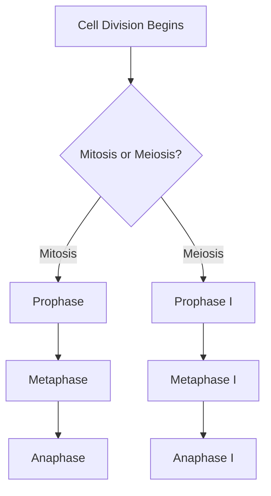
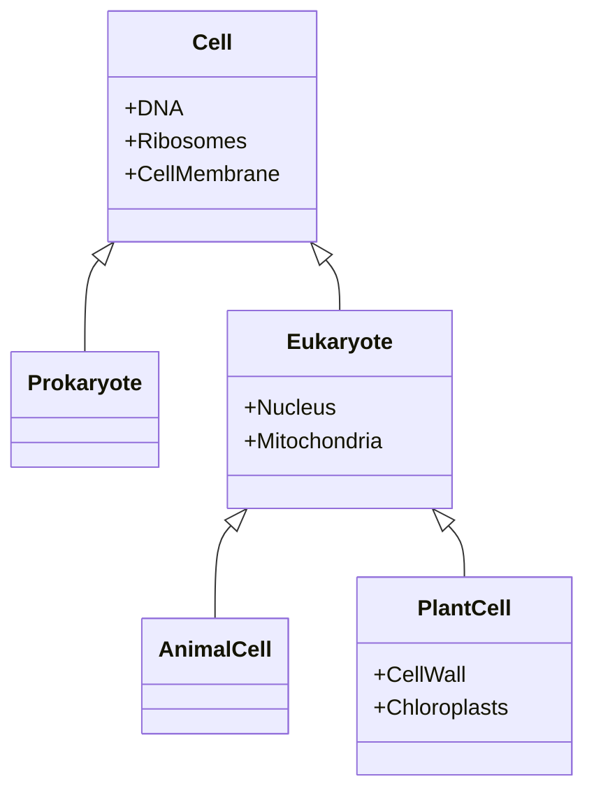
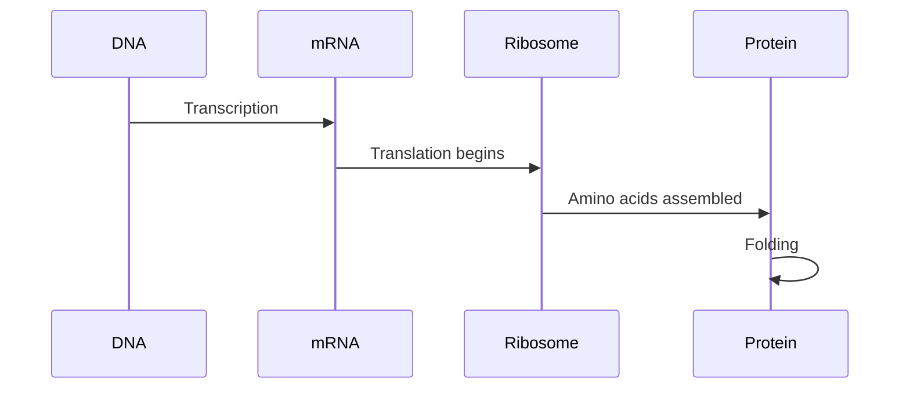
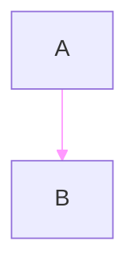
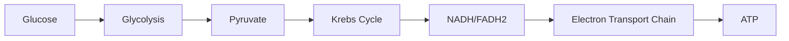

# Content Formats Guide

Complete reference for all content types generated by the educational course Generator.

## Quick Reference Card

| Format Type | Scope | File Format | Typical Length | Generated By |
|-------------|-------|-------------|----------------|--------------|
| **Lecture** | Per session | `.md` | 2000-4000 words | Stage 04 |
| **Lab** | Per session | `.md` | 1000-2000 words | Stage 04 |
| **Study Notes** | Per session | `.md` | 500-1000 words | Stage 04 |
| **Diagram** | Per session | `.mmd` | Visual | Stage 04 |
| **Questions** | Per session | `.md` | 20-30 items | Stage 04 |
| **Application** | Per session | `.md` | 800-1200 words | Stage 05 |
| **Extension** | Per session | `.md` | 800-1200 words | Stage 05 |
| **Visualization** | Per session | `.mmd` | Visual | Stage 05 |
| **Integration** | Per session | `.md` | 600-1000 words | Stage 05 |
| **Investigation** | Per session | `.md` | 600-1000 words | Stage 05 |
| **Open Questions** | Per session | `.md` | 600-1000 words | Stage 05 |

**Read time**: 30-45 minutes | **Audience**: Content creators, course designers

## Overview

The system generates content in two categories:

### Primary Materials (Stage 04)
**Core instructional content** generated for all modules (session-based):
1. **Lectures** - Full instructional content
2. **Labs** - Laboratory exercises with procedures
3. **Study Notes** - Concise summaries
4. **Diagrams** - Mermaid visualizations
5. **Questions** - Comprehension assessments

### Secondary Materials (Stage 05)
**Supplementary content** generated per session (session-level):
6. **Application** - Real-world applications and case studies
7. **Extension** - Advanced topics beyond core curriculum
8. **Visualization** - Additional diagrams and concept maps (Mermaid format)
9. **Integration** - Cross-module connections and synthesis
10. **Investigation** - Research questions and experiments
11. **Open Questions** - Current scientific debates and frontiers

All formats are **text-based** (Markdown/Mermaid) for easy editing and version control.

**Terminology**: "Primary" materials are session-specific essential content; "Secondary" materials are session-level optional enrichment that synthesizes session context.

## Format 1: Lectures

**Purpose**: Comprehensive instructional content for classroom or self-study

**Generator**: `src.generate.formats.lectures.LectureGenerator`

**Configuration**:
```yaml
modules:
  - id: 1
    name: "Cell Biology"
    num_lectures: 2          # Generate 2 lectures per module
    content_length: 3000     # Target ~3000 words per lecture
    subtopics:
      - "Cell structure"
      - "Cell function"
    learning_objectives:
      - "Understand cell organization"
```

**Output File**: `output/modules/module_01_cell_biology/session_01/lecture.md`

**Format Structure**:
```markdown
# Cell Biology

## Learning Objectives

- Understand cell organization
- Explain organelle functions

---

## Introduction

Cells are the basic unit of life...

## Cell Structure

### Nucleus
The nucleus contains...

### Mitochondria
Mitochondria are...

## Cell Function

...

## Summary

Key points covered:
- ...
```

**LLM Prompt Template** (`config/llm_config.yaml`):
```yaml
prompts:
  lecture:
    system: "You are an expert {subject} professor writing detailed lecture content."
    template: |
      Write a comprehensive lecture on: {module_name}
      
      Cover these topics:
      {subtopics}
      
      Learning objectives:
      {objectives}
      
      Target length: {content_length} words
```

**Customization Options**:
- Adjust `content_length` for shorter/longer lectures
- Modify system prompt for different teaching styles
- Use `num_lectures` for multiple perspectives on same module

## Format 2: Laboratory Exercises

**Purpose**: Hands-on experimental procedures

**Generator**: `src.generate.formats.labs.LabGenerator`

**Configuration**:
```yaml
modules:
  - id: 1
    name: "Cell Biology"
    num_labs: 2              # Generate 2 different labs
    subtopics:
      - "Microscopy techniques"
      - "Cell staining"
```

**Output Files**:
- `output/modules/module_01_cell_biology/session_01/lab.md`
- `output/modules/module_01_cell_biology/session_02/lab.md`

**Format Structure**:
```markdown
# Cell Biology - Laboratory Exercise 1

## Lab Focus: Microscopy techniques

## Objectives

- Learn proper microscope use
- Observe cell structures

---

## Materials Required

- Compound microscope
- Prepared slides
- Lens paper
...

## Safety Precautions

- Handle slides carefully
- Clean lenses properly
...

## Procedure

### Part A: Microscope Setup
1. Place microscope on flat surface
2. Check light source
...

### Part B: Observing Specimens
1. Start with lowest magnification
2. Focus using coarse adjustment
...

## Data Collection

| Specimen | Magnification | Observations |
|----------|---------------|--------------|
| Onion cells | 40x | |
| Cheek cells | 100x | |

## Analysis Questions

1. What structures did you observe?
2. How do plant and animal cells differ?
...

## References

- Lab Manual Chapter 3
- Safety Guidelines
```

**LLM Prompt Template**:
```yaml
prompts:
  lab:
    system: "You are an experienced biology lab instructor."
    template: |
      Create a laboratory exercise for: {module_name}
      
      Lab number: {lab_number}
      Focus on: {lab_focus}
      
      Include:
      - Materials list
      - Safety precautions
      - Step-by-step procedure
      - Data collection tables
      - Analysis questions
```

## Format 3: Study Notes

**Purpose**: Concise review material for exam preparation

**Generator**: `src.generate.formats.study_notes.StudyNotesGenerator`

**Output File**: `output/modules/module_01_cell_biology/session_01/study_notes.md`

**Format Structure**:
```markdown
# Cell Biology - Study Notes

## Key Concepts

### 1. Cell Theory
- All living things are made of cells
- Cells are the basic unit of life
- Cells come from pre-existing cells

### 2. Cell Structure

**Nucleus**
- Contains DNA
- Controls cell activities
- Surrounded by nuclear envelope

**Mitochondria**
- "Powerhouse of the cell"
- ATP production via cellular respiration
- Double membrane structure

### 3. Cell Function
...

## Important Terms

- **Prokaryote**: Cell without nucleus
- **Eukaryote**: Cell with membrane-bound nucleus
- **Organelle**: Specialized cell structure
...

## Key Facts to Remember

✓ Animal cells have centrioles; plant cells don't
✓ Plant cells have cell walls; animal cells don't
✓ Mitochondria have their own DNA

## Common Exam Questions

1. **Compare prokaryotic and eukaryotic cells**
   - Prokaryotes: No nucleus, smaller, simpler
   - Eukaryotes: Has nucleus, larger, complex

2. **Explain endosymbiotic theory**
   - Mitochondria were once independent bacteria
   - Evidence: Own DNA, double membrane
...

## Mnemonics

**"CRAM" for Cell Parts**:
- C: Cytoplasm
- R: Ribosomes
- A: (Cell Membrane creates) An outer boundary
- M: Mitochondria
```

**LLM Prompt Template**:
```yaml
prompts:
  study_notes:
    system: "You are creating concise study materials."
    template: |
      Create study notes for: {module_name}
      
      Topics: {subtopics}
      
      Include:
      - Key concepts (bullet points)
      - Important terms with definitions
      - Facts to memorize
      - Common exam questions with answers
      - Memory aids/mnemonics
```

## Format 4: Diagrams (Mermaid)

**Purpose**: Visual representations of concepts and processes

**Generator**: `src.generate.formats.diagrams.DiagramGenerator`

**Configuration**:
```yaml
modules:
  - id: 1
    name: "Cell Biology"
    num_diagrams: 4          # Generate 4 diagrams
    subtopics:
      - "Cell structure"     # Used as diagram topics
      - "Cell division"
```

**Output Files**:
- `output/modules/module_01_cell_biology/session_01/diagram_1.mmd`
- `output/modules/module_01_cell_biology/session_01/diagram_2.mmd`
- etc.

**Mermaid Diagram Types**:

### Flowchart (Processes)


### Class Diagram (Hierarchies)


### Sequence Diagram (Interactions)


**LLM Prompt Template**:
```yaml
prompts:
  diagram:
    system: "You are creating Mermaid diagram code."
    template: |
      Create a Mermaid diagram for: {topic}
      
      Context: {context}
      
      Choose appropriate diagram type:
      - Flowchart (graph TD) for processes
      - Class diagram for hierarchies
      - Sequence diagram for interactions
      
      Output ONLY the Mermaid code, no markdown fences.
```

**Automatic Cleanup**:

All Mermaid diagrams automatically undergo cleanup to ensure compatibility:

- **Code Fences Removed**: Markdown code fences (```mermaid ... ```) are automatically stripped
- **linkStyle Commands Removed**: `linkStyle` commands are removed (not supported in all renderers)
- **Style Commands Removed**: `style` and `classDef` commands are removed for compatibility
- **Explanatory Text Removed**: Any explanatory text before or after the diagram code is removed
- **Pure Diagram Code**: Only valid Mermaid syntax remains in the output file

**Example Cleanup**:

**Before cleanup**:


**Explanation:** This diagram shows a simple flow.

**After cleanup**:
```
graph TD
    A --> B
```

**Viewing Diagrams**:
1. Copy `.mmd` file content
2. Paste into [Mermaid Live Editor](https://mermaid.live)
3. Or use Markdown viewer that supports Mermaid (Obsidian, VS Code)

## Format 5: Comprehension Questions

**Purpose**: Assessment and self-testing

**Generator**: `src.generate.formats.questions.QuestionGenerator`

**Configuration**:
```yaml
modules:
  - id: 1
    name: "Cell Biology"
    num_questions: 20        # Total questions
    # Automatically distributed:
    # - 50% Multiple Choice (10)
    # - 30% Short Answer (6)
    # - 20% Essay (4)
```

**Output File**: `output/modules/module_01_cell_biology/session_01/questions.md`

**Format Structure**:
```markdown
# Cell Biology - Comprehension Questions

**Total Questions**: 20  
**Multiple Choice**: 10 | **Short Answer**: 6 | **Essay**: 4

---

**Question 1:** Which of the following is NOT a characteristic of prokaryotic cells?
A) Lack of nucleus
B) Presence of ribosomes
C) Membrane-bound organelles
D) Cell membrane

**Answer:** C
**Explanation:** Prokaryotic cells lack membrane-bound organelles like mitochondria and endoplasmic reticulum.

**Question 2:** What is the primary function of mitochondria?
A) Protein synthesis
B) ATP production
C) DNA storage
D) Waste removal

**Answer:** B
**Explanation:** Mitochondria are the powerhouses of the cell, responsible for ATP production through cellular respiration.

**Question 11:** Explain the difference between prokaryotic and eukaryotic cells. (3-4 sentences)

**Answer:** Prokaryotic cells lack a membrane-bound nucleus and organelles, while eukaryotic cells have both. Prokaryotes are generally smaller and simpler in structure. Examples of prokaryotes include bacteria, while animals, plants, and fungi are eukaryotes. Eukaryotic cells have compartmentalized functions within organelles.

**Question 17:** Describe the endosymbiotic theory and provide evidence supporting it. Explain how this theory accounts for the presence of mitochondria and chloroplasts in eukaryotic cells. (300-400 words)

**Answer:** The endosymbiotic theory proposes that mitochondria and chloroplasts originated as independent prokaryotic organisms that were engulfed by ancestral eukaryotic cells...
```

**Format Notes**:
- **Question format**: `**Question N:**` (colon inside bold markers) - This is the actual format used
- **Answer format**: `**Answer:**` (bold with colon)
- **Explanation format**: `**Explanation:**` (bold with colon, typically for multiple choice questions)
- Questions are numbered sequentially (1, 2, 3...) regardless of type
- Multiple choice questions include A-D options
- Short answer and essay questions may include length/word count guidance

**Distribution**:
- **Multiple Choice**: Quick recall, specific facts
- **Short Answer**: Understanding, brief explanations
- **Essay**: Deep understanding, synthesis, critical thinking

## Format 6: Knowledge Base (Obsidian-Linked) - *Planned Feature*

**Status**: ⚠️ **Not yet implemented** - This format is planned for future release

**Purpose**: Interconnected concept notes for knowledge management

**Generator**: `src.generate.formats.knowledge_base.KnowledgeBaseGenerator` (planned)

**Configuration**:
```yaml
knowledge_base:
  enabled: true
  linking_style: "obsidian"      # [[WikiLinks]] format
  auto_link_concepts: true        # Automatically link related terms
  include_diagrams: true          # Embed Mermaid diagrams
  concepts_per_module: 10         # Generate 10 concept notes per module
```

**Output Files**:
- `output/knowledge_base/Cell_Structure.md`
- `output/knowledge_base/Mitochondria.md`
- `output/knowledge_base/Cell_Division.md`
- etc.

**Format Structure with Obsidian Linking**:
```markdown
# Mitochondria

## Tags
#cell-biology #organelles #energy #ATP

## Definition

The **mitochondria** are double-membrane-bound organelles found in most [[Eukaryotic Cell|eukaryotic cells]]. Often called the "powerhouse of the cell" due to their role in [[ATP]] production through [[Cellular Respiration]].

## Structure

- **Outer Membrane**: Smooth, permeable to small molecules
- **Inner Membrane**: Highly folded into [[Cristae]], contains [[Electron Transport Chain]]
- **Matrix**: Contains enzymes for [[Krebs Cycle]], [[Mitochondrial DNA]]
- **Intermembrane Space**: Between outer and inner membranes

## Function

Primary function is [[ATP]] synthesis via:
1. [[Glycolysis]] (in cytoplasm)
2. [[Krebs Cycle]] (in matrix)
3. [[Oxidative Phosphorylation]] (on inner membrane)

See: [[Cellular Respiration]]

## Diagram



## Related Concepts

- [[Cell Structure]]
- [[Energy Metabolism]]
- [[Endosymbiotic Theory]]
- [[Chloroplasts]] (similar origin)
- [[Prokaryotic Cells]] (origin of mitochondria)

## Connections to Other Modules

- [[Module 2 - Genetics]]: Mitochondrial DNA inheritance
- [[Module 4 - Evolution]]: Endosymbiotic theory evidence
- [[Module 7 - Metabolism]]: Central role in energy production

## Study Questions

1. Why do mitochondria have their own DNA?
2. How does the structure of cristae relate to function?
3. Compare mitochondria in [[Muscle Cells]] vs other cell types

## References

- Lecture: [[Cell Biology Lecture 1]]
- Lab: [[Cell Biology Lab 2 - Mitochondrial Staining]]
- Questions: [[Cell Biology Questions]] #Q5, #Q12
```

**Auto-Linking Features**:
- Detects concept names and creates `[[links]]`
- Links to related modules
- Links to other content (lectures, labs, questions)
- Creates bidirectional connections
- Tags for categorization

**Benefits**:
- Non-linear navigation
- Discover connections between concepts
- Build personal knowledge graph
- Perfect for Obsidian, Logseq, or similar PKM tools

## Format Comparison

| Format | Length | Purpose | Best For |
|--------|--------|---------|----------|
| **Lectures** | 2000-4000 words | Comprehensive instruction | Deep learning |
| **Labs** | 1000-2000 words | Hands-on practice | Skill development |
| **Study Notes** | 500-1000 words | Quick review | Exam prep |
| **Diagrams** | Visual | Concept visualization | Visual learners |
| **Questions** | 20-30 items | Assessment | Self-testing |
| **Knowledge Base** | 300-500 words/concept | Interconnected learning | Long-term retention |

## Customization Examples

### Example 1: High School vs University

**High School** (`config/course_config.yaml`):
```yaml
modules:
  - id: 1
    name: "Cell Biology"
    content_length: 2000     # Shorter lectures
    num_questions: 15        # Fewer questions
    num_diagrams: 3          # More visual aids
```

**University** (`config/course_config.yaml`):
```yaml
modules:
  - id: 1
    name: "Cell Biology"
    content_length: 4000     # Longer, detailed lectures
    num_questions: 30        # More comprehensive assessment
    num_diagrams: 2          # Assume prior knowledge
```

### Example 2: Lab-Heavy Course

```yaml
modules:
  - id: 1
    name: "Cell Biology"
    num_lectures: 1          # Brief theoretical intro
    num_labs: 3              # Multiple hands-on exercises
    num_questions: 25        # Focus on practical application
```

### Example 3: Self-Study Course

```yaml
modules:
  - id: 1
    name: "Cell Biology"
    num_lectures: 2          # Comprehensive coverage
    num_labs: 1              # Optional practical
    num_questions: 30        # Extensive self-assessment
```

### Example 4: Modular Sessions

**Use Case**: Multi-session modules with session-specific content

**Current System** (JSON outline-driven, automatic):
```json
{
  "modules": [
    {
      "module_id": 1,
      "module_name": "Cell Biology",
      "sessions": [
        {
          "session_number": 1,
          "session_title": "Cell Structure and Membrane Organization",
          "subtopics": ["Cell structure", "Membrane organization"],
          "learning_objectives": ["Describe cell components"],
          "key_concepts": ["Cell theory", "Compartmentalization"],
          "rationale": "Foundation for understanding cellular organization"
        },
        {
          "session_number": 2,
          "session_title": "Organelle Functions and Cellular Processes",
          "subtopics": ["Organelle functions", "Cellular processes"],
          "learning_objectives": ["Explain organelle roles"],
          "key_concepts": ["Energy production", "Protein synthesis"],
          "rationale": "Understanding how organelles contribute to cellular function"
        }
      ]
    }
  ]
}
```

**Generated Output** (automatic per session):
```
output/modules/module_01_cell_biology/
  session_01/
    lecture.md        # Cell structure focus
    lab.md            # Microscopy techniques
    study_notes.md    # Session 1 summary
    diagram_1.mmd     # Cell structure diagrams
    diagram_2.mmd
    questions.md      # Cell structure assessment
    application.md    # Session-level secondary (Stage 05)
    extension.md
    visualization.mmd
    integration.md
    investigation.md
    open_questions.md
  session_02/
    lecture.md        # Organelle functions focus
    lab.md            # Cell function experiments
    study_notes.md    # Session 2 summary
    diagram_1.mmd     # Organelle diagrams
    diagram_2.mmd
    questions.md      # Organelle assessment
    application.md    # Session-level secondary (Stage 05)
    extension.md
    ...
```

---

## Practical Use Cases

### Use Case 1: Self-Paced Online Course

**Requirements**:
- Comprehensive lectures (self-contained)
- Extensive study notes (no instructor)
- More questions (self-assessment)
- Fewer labs (optional)

**Configuration Impact**:
```yaml
# Emphasize self-study materials
# Each session generates:
# - 1 lecture (3000-4000 words, very detailed)
# - 1 study notes (800-1000 words, comprehensive)
# - 1 questions set (30 items, more self-check)
# - 1 diagram (visual aid)
# - 0-1 labs (optional, can be simulated)
```

**Result**: Rich text-based materials optimized for independent learning

---

### Use Case 2: Lab-Intensive Course

**Requirements**:
- Brief lectures (theory overview)
- Multiple labs per session (hands-on focus)
- Practical questions (application-based)
- Detailed diagrams (experimental setups)

**Configuration Impact**:
```yaml
# Emphasize practical materials
# Each session generates:
# - 1 lecture (1500-2000 words, concise theory)
# - 2-3 labs (detailed procedures, safety, analysis)
# - 1 study notes (focused on practical skills)
# - 2-3 diagrams (experimental setups, procedures)
# - 1 questions set (application-focused)
```

**Result**: Practical, hands-on materials with emphasis on laboratory skills

---

### Use Case 3: Flipped Classroom

**Requirements**:
- Pre-class materials (lectures, videos)
- In-class activities (labs, discussions)
- Post-class review (study notes, questions)

**Session Structure**:
```
Session 1 (Week 1):
  Pre-class (students read at home):
    - lecture.md          # Cell structure theory
    - diagrams/           # Visual aids
    
  In-class (instructor-led):
    - lab.md              # Microscopy hands-on
    - discussion prompts  # From lecture content
    
  Post-class (homework):
    - study_notes.md      # Key points review
    - questions.md        # Self-assessment
```

**Stage 05 Supplements** (for advanced students):
```
  session_01/
    extension.md      # Advanced cell biology
    investigation.md  # Research questions
    open_questions.md  # Current debates
```

---

### Use Case 4: Hybrid Course (Online + In-Person)

**Requirements**:
- Async materials (lectures, study notes)
- Sync materials (labs for in-person sessions)
- Flexible assessments (online questions)

**Module Organization**:
```
Module 1: Cell Biology (3 sessions)

  Online Components (all sessions):
    - lectures (video-friendly format)
    - study_notes (quick reference)
    - questions (online quiz format)
    - diagrams (embed in slides)
  
  In-Person Components (sessions 2-3 only):
    - labs (hands-on experiments)
    - application materials (case studies)
  
  Supplementary (optional):
    - extension materials (honors students)
    - visualization materials (additional diagrams)
```

---

### Use Case 5: Mastery-Based Learning

**Requirements**:
- Modular content (students progress at own pace)
- Rich assessment (verify mastery)
- Multiple pathways (extensions for advanced students)

**Content Organization**:
```
Module 1: Cell Biology
  session_01/ (Mastery Unit 1)
    lecture.md           # Core content
    study_notes.md       # Learning objectives
    questions.md         # Mastery assessment (must score 80%+)
    
  session_02/ (Mastery Unit 2)
    lecture.md           # Build on Unit 1
    lab.md               # Practical mastery
    questions.md         # Mastery assessment
  
  # Extension materials (for students who master early) - session-level:
  session_01/
    extension.md         # Advanced topics
    investigation.md     # Research projects
    open_questions.md    # Critical thinking
```

**Assessment Strategy**:
- Session questions: Mastery checkpoints (must pass to advance)
- Extension materials: Enrichment for fast learners
- Application materials: Real-world skill demonstration

## Output Directory Structure

All generated content is organized by module and session in a session-based structure:

```
output/
├── outlines/
│   ├── course_outline_TIMESTAMP.json  # JSON structure (machine-readable)
│   └── course_outline_TIMESTAMP.md    # Markdown format (human-readable)
└── modules/
    └── module_01_molecular_and_cellular_foundations/
        ├── session_01/                   # Primary materials (Stage 04)
        │   ├── lecture.md
        │   ├── lab.md
        │   ├── study_notes.md
        │   ├── diagram_1.mmd
        │   ├── diagram_2.mmd
        │   ├── questions.md
        │   ├── application.md            # Secondary materials (Stage 05)
        │   ├── extension.md
        │   ├── visualization.mmd
        │   ├── integration.md
        │   ├── investigation.md
        │   └── open_questions.md
        ├── session_02/
        │   ├── lecture.md
        │   ├── lab.md
        │   └── ... (same structure)
        └── session_03/
            └── ...
```

**Note**: When using course templates (e.g., `biology`, `chemistry`), the path includes the course name: `output/{course_name}/modules/module_XX/...`. When using default config (no template), paths are `output/modules/...` (no course subdirectory).

### Session-Based Primary Outputs (Stage 04)
- All primary materials are saved to `output/modules/module_{id:02d}_{slug}/session_{n:02d}/`
- Each session includes: `lecture.md`, `lab.md`, `study_notes.md`, `diagram_1.mmd`, `diagram_2.mmd`, `questions.md`

### Secondary Materials (Stage 05)
- Generated per session directly in session folders:
  - `application.md` (real-world applications)
  - `extension.md` (advanced topics)
  - `visualization.mmd` (additional Mermaid diagrams)
  - `integration.md` (cross-module connections)
  - `investigation.md` (research questions/experiments)
  - `open_questions.md` (ongoing scientific questions)

## Integration with Other Tools

### Obsidian
1. Copy `output/` to your Obsidian vault
2. All `[[links]]` work automatically
3. View Mermaid diagrams inline
4. Use graph view to see connections

### Markdown Editors
- **VS Code**: Install Markdown Preview Enhanced
- **Typora**: Built-in Mermaid support
- **Mark Text**: Supports all formats

### LMS Integration
- Export to PDF for upload
- Use HTML conversion
- Direct markdown support (Canvas, Moodle)

## Validation and Quality Checks

All generated content is automatically validated against quality criteria. The system reports validation status as either **[COMPLIANT]** or **[NEEDS REVIEW]**.

**See [VALIDATION.md](VALIDATION.md)** for complete validation documentation, including:
- Validation criteria for all content types
- Configuration and customization
- Troubleshooting validation issues
- Custom validation rules

### Validation Status

**COMPLIANT** ✓ - Content meets all quality requirements:
- Word counts within specified ranges
- Required elements present (examples, sections, key concepts)
- No validation warnings detected

**NEEDS REVIEW** ⚠️ - Content has one or more validation warnings:
- May still be usable but requires review
- Warnings indicate specific issues to address
- Common issues: word count outside range, missing elements, format issues

### Quick Reference: Validation Criteria by Format

#### Lectures

**Requirements** (configurable in `llm_config.yaml`):
- Word count: 1000-1500 words (default)
- Examples: 5-15 examples
- Sections: 4-8 major sections
- Terms defined: Automatic detection

**Common Warnings**:
- `⚠️ Word count (899) below minimum 1000` - Content too short
- `⚠️ Too many examples (16, maximum 15)` - Exceeds example limit
- `⚠️ Too few sections (3, minimum 4)` - Insufficient structure

**How to Address**:
- Word count too low: Regenerate with adjusted prompt or manually expand content
- Too many examples: Edit to remove excess examples
- Too few sections: Regenerate or manually add section breaks

#### Study Notes

**Requirements**:
- Key concepts: 3-10 concepts (default)
- Word count: Maximum 1200 words (default)
- Structure: Bullet points with key concept highlights

**Common Warnings**:
- `⚠️ Too many key concepts (11, maximum 10)` - Exceeds concept limit
- `⚠️ Only 0 key concepts highlighted (require 3-10)` - Missing key concept formatting
- `⚠️ Word count (1500) exceeds maximum 1200` - Content too long

**How to Address**:
- Too many concepts: Edit to consolidate or remove less critical concepts
- Missing concepts: Regenerate or manually add key concept formatting
- Word count too high: Edit to condense content

#### Questions

**Requirements**:
- Question count: Matches requested number (typically 10)
- Answers: All questions should have answers
- Explanations: Multiple choice questions should have explanations

**Common Warnings**:
- `⚠️ No questions detected - check question format` - Format parsing issue
- `⚠️ Missing answers: 2 questions lack answers` - Incomplete content
- `⚠️ Missing explanations: 3 MC questions lack explanations` - Missing explanations

**How to Address**:
- No questions detected: Check question format matches expected patterns (`**Question N:**` or `## Question N`)
- Missing answers: Regenerate or manually add answers
- Missing explanations: Regenerate or manually add explanations

**Supported Question Formats**:
- `**Question 1:**` (colon inside bold markers) - **ACTUAL/PREFERRED FORMAT**
- `**Question 1**` (without colon) - Fallback format
- `**Question 1**:` (colon after bold markers) - Fallback format
- `## Question 1` (markdown heading) - Alternative format
- `Q1:` or `Q 1:` (abbreviated format) - Alternative format
- `1.` or `1)` (numbered list with question mark) - Alternative format

**Note**: The system detects questions using the `**Question N:**` format where the colon is inside the bold markers. This is the format generated by the LLM and is automatically detected by the validation system.

#### Labs

**Requirements**:
- Procedure steps: Detected automatically
- Safety warnings: Detected automatically
- Data tables: Detected automatically

**Validation**: Labs are validated for structure and completeness, but specific warnings vary by content.

#### Diagrams

**Requirements**:
- Valid Mermaid syntax
- Diagram type declaration (graph/flowchart/etc.)
- Nodes and connections present

**Common Issues**:
- Code fences removed automatically
- Unsupported style commands removed
- Missing diagram type: Added automatically when possible

#### Secondary Materials

**Application**:

**Requirements** (configurable in `llm_config.yaml`):
- Applications: 3-5 applications
- Words per application: 150-200 words
- Total words: Maximum 1000 words

**Common Warnings**:
- `⚠️ Only 2 applications found (require 3-5, need 1 more)` - Too few applications
- `⚠️ Application 1 has 100 words (require 150-200, need 50 more words)` - Application too short
- `⚠️ Total word count (1200) exceeds maximum 1000` - Content too long

**Extension**:

**Requirements**:
- Topics: 3-4 topics
- Words per topic: 100-150 words
- Total words: Maximum 600 words

**Common Warnings**:
- `⚠️ Only 2 topics found (require 3-4, need 1 more)` - Too few topics
- `⚠️ Topic 1 has 80 words (require 100-150, need 20 more words)` - Topic too short
- `⚠️ Total word count (800) exceeds maximum 600` - Content too long

**Visualization**:

**Requirements**:
- Diagram elements: Minimum 3 elements (nodes + connections)
- Valid Mermaid syntax

**Common Warnings**:
- `⚠️ Only 2 diagram elements found (require at least 3)` - Too few elements
- Mermaid validation warnings (missing diagram type, no connections, etc.)

**Integration**:

**Requirements**:
- Connections: Minimum 3 cross-module connections
- Total words: Maximum 1000 words

**Common Warnings**:
- `⚠️ Only 1 connections found (require at least 3, need 2 more)` - Too few connections
- `⚠️ Total word count (1200) exceeds maximum 1000` - Content too long

**Investigation**:

**Requirements**:
- Research questions: Minimum 3 questions
- Total words: Maximum 1000 words

**Common Warnings**:
- `⚠️ Only 2 research questions found (require at least 3, need 1 more)` - Too few questions
- `⚠️ Total word count (1200) exceeds maximum 1000` - Content too long

**Open Questions**:

**Requirements**:
- Open questions: Minimum 3 questions
- Total words: Maximum 1000 words

**Common Warnings**:
- `⚠️ Only 2 open questions found (require at least 3, need 1 more)` - Too few questions
- `⚠️ Total word count (1200) exceeds maximum 1000` - Content too long

**How to Address Secondary Material Warnings**:
- Too few items: Regenerate or manually add missing applications/topics/questions
- Word count issues: Edit to expand or condense content as needed
- Missing connections: Add explicit references to other modules/topics
- Diagram issues: Review Mermaid syntax and add missing elements

**For complete validation documentation, see [VALIDATION.md](VALIDATION.md)**.

## Best Practices

1. **Review Generated Content**: Always review for accuracy
2. **Edit as Needed**: All formats are editable markdown
3. **Version Control**: Commit to git after generation and review
4. **Customize Prompts**: Adjust templates in `config/llm_config.yaml`
5. **Mix Formats**: Use different formats for different learning styles

## Next Steps

- See [PIPELINE_GUIDE.md](PIPELINE_GUIDE.md) for generation workflows
- See [CONFIGURATION.md](CONFIGURATION.md) for detailed configuration
- See [ARCHITECTURE.md](ARCHITECTURE.md) for system design

## Summary

**Six formats, infinite possibilities:**
- **Lectures**: Teach
- **Labs**: Practice
- **Notes**: Review
- **Diagrams**: Visualize
- **Questions**: Assess
- **Knowledge Base**: Connect

All text-based, all editable, all version-controlled.

---

## Related Documentation

### Configuration & Generation
- **[CONFIGURATION.md](CONFIGURATION.md)** - Configure content amounts and LLM prompts for each format
- **[PIPELINE_GUIDE.md](PIPELINE_GUIDE.md)** - Stages 04-05 generate these formats
- **[JSON_OUTLINE.md](JSON_OUTLINE.md)** - Session-based structure drives format generation

### Technical Details
- **[API.md](API.md)** - Format generator APIs (LectureGenerator, LabGenerator, etc.)
- **[ARCHITECTURE.md](ARCHITECTURE.md)** - Format generators in system architecture

### Format-Specific Topics
| Format | Configuration | Generator API | Prompt Template |
|--------|---------------|---------------|-----------------|
| **Lectures** | [CONFIGURATION.md](CONFIGURATION.md) (content_length) | [API.md](API.md) → LectureGenerator | [CONFIGURATION.md](CONFIGURATION.md) → prompts.lecture |
| **Labs** | [CONFIGURATION.md](CONFIGURATION.md) (num_labs) | [API.md](API.md) → LabGenerator | [CONFIGURATION.md](CONFIGURATION.md) → prompts.lab |
| **Study Notes** | Auto-generated per session | [API.md](API.md) → StudyNotesGenerator | [CONFIGURATION.md](CONFIGURATION.md) → prompts.study_notes |
| **Diagrams** | [CONFIGURATION.md](CONFIGURATION.md) (num_diagrams) | [API.md](API.md) → DiagramGenerator | [CONFIGURATION.md](CONFIGURATION.md) → prompts.diagram |
| **Questions** | [CONFIGURATION.md](CONFIGURATION.md) (num_questions) | [API.md](API.md) → QuestionGenerator | [CONFIGURATION.md](CONFIGURATION.md) → prompts.questions |
| **Secondary** | Stage 05 types | [PIPELINE_GUIDE.md](PIPELINE_GUIDE.md) → Stage 05 | [CONFIGURATION.md](CONFIGURATION.md) → prompts |

### Use Cases
| Scenario | Relevant Section |
|----------|------------------|
| **Customize lecture length** | This document → Lectures → Customization Options |
| **Adjust question distribution** | This document → Questions → Distribution |
| **Change diagram types** | This document → Diagrams → Mermaid Diagram Types |
| **Session vs module content** | [JSON_OUTLINE.md](JSON_OUTLINE.md) → Consumption Process |
| **Output directory structure** | This document → Output Directory Structure |
| **Obsidian integration** | This document → Integration with Other Tools |

