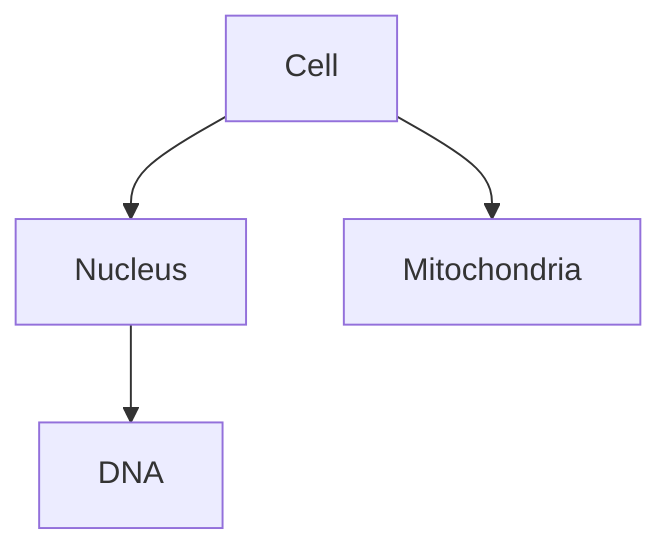

# Content Validation Guide

Complete reference for content validation rules, criteria, troubleshooting, and best practices in the educational course Generator.

## Quick Reference Card

| Aspect | Details |
|--------|---------|
| **Validation Status** | [COMPLIANT] or [NEEDS REVIEW] |
| **Automatic Validation** | All content validated after generation |
| **Configuration** | `config/llm_config.yaml` → `content_generation` section |
| **Validation Functions** | `src.utils.content_analysis.analyzers` |
| **Status Reporting** | Logged with detailed metrics and warnings |

**Read time**: 25-35 minutes | **Audience**: Content creators, course designers, developers

## Overview

All generated content is automatically validated against quality criteria. The system reports validation status as either **[COMPLIANT]** or **[NEEDS REVIEW]**.

**COMPLIANT** ✓ - Content meets all quality requirements:
- Word counts within specified ranges
- Required elements present (examples, sections, key concepts)
- No validation warnings detected

**NEEDS REVIEW** ⚠️ - Content has one or more validation warnings:
- May still be usable but requires review
- Warnings indicate specific issues to address
- Common issues: word count outside range, missing elements, format issues

## Validation Architecture

### Validation Flow

```
Content Generation
    ↓
Automatic Cleanup (conversational artifacts, placeholders, Mermaid diagrams, duplicate headings)
    ↓
Content Analysis (word count, structure, elements)
    ↓
Requirement Comparison (against config criteria)
    ↓
Warning Generation (for violations)
    ↓
Status Assignment ([COMPLIANT] or [NEEDS REVIEW])
    ↓
Logging (with detailed metrics)
```

### Automatic Content Cleanup

All generated content automatically undergoes cleanup before validation to ensure professional quality:

**Conversational Artifact Removal**:
- Removes informal phrases like "Okay, here's...", "Alright,", "Sure,"
- Removes meta-commentary like "I understand the requirements...", "I have carefully adhered..."
- Removes prompts like "Would you like...", "Let me know if...", "Do you have any further..."
- Patterns are case-insensitive and match at line start or within content

**Placeholder Standardization**:
- Replaces specific instructor names ("Dr. Smith", "Professor García") → `[INSTRUCTOR]`
- Replaces specific dates ("October 26, 2023") → `[DATE]`
- Supports Unicode characters in names

**Word Count Statement Removal**:
- Removes LLM-generated word count statements like "Word Count: 198 words"
- Removes word count sections at end of files

**Mermaid Diagram Cleanup** (for visualization/diagram content):
- Removes markdown code fences (```mermaid ... ```)
- Removes `linkStyle` commands (not supported in all renderers)
- Removes `style` and `classDef` commands
- Removes explanatory text before and after diagram code
- Extracts only valid Mermaid diagram syntax

**Duplicate Heading Removal** (for markdown content):
- Detects duplicate markdown headings at the same level
- Removes duplicates, keeping first occurrence and its content
- Case-insensitive matching (e.g., "## Key Concepts" and "## key concepts" are duplicates)

**Cleanup Pipeline**:
- Applied automatically via `full_cleanup_pipeline()` function
- Content-type aware (Mermaid cleanup for visualizations, heading cleanup for markdown)
- Idempotent (running cleanup twice produces same result)

### Validation Functions

**Module**: `src.utils.content_analysis.analyzers`

**Available Functions**:
- `analyze_lecture()` - Lecture content analysis
- `analyze_lab()` - Lab content analysis
- `analyze_questions()` - Questions content analysis
- `analyze_study_notes()` - Study notes analysis
- `analyze_application()` - Application materials analysis
- `analyze_extension()` - Extension materials analysis
- `analyze_visualization()` - Visualization/diagram analysis
- `analyze_integration()` - Integration materials analysis
- `analyze_investigation()` - Investigation materials analysis
- `analyze_open_questions()` - Open questions analysis

**Usage**:
```python
from src.utils.content_analysis import analyze_lecture, log_content_metrics

# Analyze content
requirements = {
    'min_word_count': 1000,
    'max_word_count': 1500,
    'min_examples': 5,
    'max_examples': 15,
    'min_sections': 4,
    'max_sections': 8
}
metrics = analyze_lecture(lecture_content, requirements=requirements)

# Log validation status
log_content_metrics("lecture", metrics, logger)
```

## Validation Criteria by Format

### Primary Materials

#### Lectures

**Requirements** (configurable in `llm_config.yaml`):
- Word count: 1000-1500 words (default)
- Examples: 5-15 examples
- Sections: 4-8 major sections (## headings)
- Terms defined: Automatic detection

**Metrics Collected**:
- Word count
- Character count
- Number of sections (## headings)
- Number of subsections (### headings)
- Number of examples detected
- Number of terms defined
- Number of cross-references

**Common Warnings**:
- `⚠️ Word count (899) below minimum 1000 (need 101 more words - consider regenerating or expanding content)`
- `⚠️ Word count (1600) exceeds maximum 1500 (exceeds by 100 words - consider condensing or splitting)`
- `⚠️ Only 3 examples found (require 5-15, need 2 more - add concrete examples)`
- `⚠️ Too many examples (16, maximum 15, 1 excess - consider consolidating or removing less critical examples)`
- `⚠️ Only 3 major sections (require 4-8, need 1 more - add section breaks with ## headings)`
- `⚠️ Too many sections (9, maximum 8, 1 excess - consider merging related sections)`

**How to Address**:
- Word count too low: Regenerate with adjusted prompt or manually expand content
- Word count too high: Edit to condense or split into multiple sessions
- Too few examples: Regenerate or manually add concrete examples
- Too many examples: Edit to consolidate or remove less critical examples
- Too few sections: Regenerate or manually add section breaks with ## headings
- Too many sections: Edit to merge related sections

#### Study Notes

**Requirements**:
- Key concepts: 3-10 concepts (default)
- Word count: Maximum 1200 words (default)
- Structure: Bullet points with key concept highlights

**Metrics Collected**:
- Word count
- Character count
- Number of sections
- Number of key concepts highlighted (format: `**Concept:**`)
- Number of bullet points
- Number of tables

**Common Warnings**:
- `⚠️ Too many key concepts (11, maximum 10)`
- `⚠️ Only 0 key concepts highlighted (require 3-10)`
- `⚠️ Word count (1500) exceeds maximum 1200`

**How to Address**:
- Too many concepts: Edit to consolidate or remove less critical concepts
- Missing concepts: Regenerate or manually add key concept formatting (`**Concept Name:**`)
- Word count too high: Edit to condense content

#### Questions

**Requirements**:
- Question count: Matches requested number (typically 10)
- Answers: All questions should have answers
- Explanations: Multiple choice questions should have explanations

**Metrics Collected**:
- Word count
- Character count
- Total questions detected
- Multiple choice questions
- Short answer questions
- Essay questions
- Answers provided
- Explanations provided

**Common Warnings**:
- `⚠️ No questions detected - check question format`
- `⚠️ Missing answers: 2 questions lack answers`
- `⚠️ Missing explanations: 3 MC questions lack explanations`

**How to Address**:
- No questions detected: Check question format matches expected patterns
- Missing answers: Regenerate or manually add answers
- Missing explanations: Regenerate or manually add explanations

**Supported Question Formats**:
- `**Question 1:**` (colon inside bold markers) - **ACTUAL/PREFERRED FORMAT**
- `**Question 1**` (without colon) - Fallback format
- `**Question 1**:` (colon after bold markers) - Fallback format
- `## Question 1` (markdown heading) - Alternative format
- `Q1:` or `Q 1:` (abbreviated format) - Alternative format
- `1.` or `1)` (numbered list with question mark) - Alternative format

**Note**: The system detects questions using the `**Question N:**` format where the colon is inside the bold markers. This is the format generated by the LLM and is automatically detected by the validation system.

#### Labs

**Requirements**:
- Procedure steps: Detected automatically
- Safety warnings: Detected automatically
- Data tables: Detected automatically

**Metrics Collected**:
- Word count
- Character count
- Number of procedure steps
- Number of safety warnings (⚠️ markers)
- Number of data tables
- Materials list presence

**Validation**: Labs are validated for structure and completeness, but specific warnings vary by content.

#### Diagrams

**Requirements**:
- Valid Mermaid syntax
- Diagram type declaration (graph/flowchart/etc.)
- Nodes and connections present

**Metrics Collected**:
- Character count
- Number of nodes
- Number of connections
- Diagram type
- Syntax validity

**Common Issues**:
- Code fences removed automatically
- Unsupported style commands removed
- Missing diagram type: Added automatically when possible

**Validation Function**: `validate_mermaid_syntax()` from `src.utils.content_analysis.mermaid`

### Secondary Materials

#### Application

**Requirements** (configurable in `llm_config.yaml`):
- Applications: 3-5 applications
- Words per application: 150-200 words
- Total words: Maximum 1000 words

**Common Warnings**:
- `⚠️ Only 2 applications found (require 3-5, need 1 more - add ## Application N sections)`
- `⚠️ Application 1 has 100 words (require 150-200, need 50 more words)`
- `⚠️ Total word count (1200) exceeds maximum 1000`

**How to Address**:
- Too few applications: Regenerate or manually add missing applications
- Application too short: Expand application content
- Total words too high: Edit to condense content

#### Extension

**Requirements**:
- Topics: 3-4 topics
- Words per topic: 100-150 words
- Total words: Maximum 600 words

**Common Warnings**:
- `⚠️ Only 2 topics found (require 3-4, need 1 more)`
- `⚠️ Topic 1 has 80 words (require 100-150, need 20 more words)`
- `⚠️ Total word count (800) exceeds maximum 600`

**How to Address**:
- Too few topics: Regenerate or manually add missing topics
- Topic too short: Expand topic content
- Total words too high: Edit to condense content

#### Visualization

**Requirements**:
- Diagram elements: Minimum 3 elements (nodes + connections)
- Valid Mermaid syntax

**Common Warnings**:
- `⚠️ Only 2 diagram elements found (require at least 3)`
- Mermaid validation warnings (missing diagram type, no connections, etc.)

**How to Address**:
- Too few elements: Add more nodes and connections to diagram
- Syntax issues: Review Mermaid syntax and fix errors

#### Integration

**Requirements**:
- Connections: Minimum 3 cross-module connections
- Total words: Maximum 1000 words

**Common Warnings**:
- `⚠️ Only 1 connections found (require at least 3, need 2 more - add references to other modules/topics)`
- `⚠️ Total word count (1200) exceeds maximum 1000`

**How to Address**:
- Too few connections: Add explicit references to other modules/topics
- Total words too high: Edit to condense content

#### Investigation

**Requirements**:
- Research questions: Minimum 3 questions
- Total words: Maximum 1000 words

**Common Warnings**:
- `⚠️ Only 2 research questions found (require at least 3, need 1 more)`
- `⚠️ Total word count (1200) exceeds maximum 1000`

**How to Address**:
- Too few questions: Regenerate or manually add missing questions
- Total words too high: Edit to condense content

#### Open Questions

**Requirements**:
- Open questions: Minimum 3 questions
- Total words: Maximum 1000 words

**Common Warnings**:
- `⚠️ Only 2 open questions found (require at least 3, need 1 more)`
- `⚠️ Total word count (1200) exceeds maximum 1000`

**How to Address**:
- Too few questions: Regenerate or manually add missing questions
- Total words too high: Edit to condense content

## Validation Configuration

### Configuration File

Validation criteria are configured in `config/llm_config.yaml`:

```yaml
content_generation:
  lecture:
    min_word_count: 1000
    max_word_count: 1500
    min_examples: 5
    max_examples: 15
    min_sections: 4
    max_sections: 8
  study_notes:
    min_key_concepts: 3
    max_key_concepts: 10
    max_word_count: 1200
  application:
    min_applications: 3
    max_applications: 5
    min_words_per_application: 150
    max_words_per_application: 200
    max_total_words: 1000
  extension:
    min_topics: 3
    max_topics: 4
    min_words_per_topic: 100
    max_words_per_topic: 150
    max_total_words: 600
  visualization:
    min_diagram_elements: 3
  integration:
    min_connections: 3
    max_total_words: 1000
  investigation:
    min_questions: 3
    max_total_words: 1000
  open_questions:
    min_questions: 3
    max_total_words: 1000
```

### Accessing Requirements

```python
from src.config.loader import ConfigLoader

config = ConfigLoader("config")
requirements = config.get_content_requirements()

# Get lecture requirements
lecture_reqs = requirements['lecture']
# Returns: {'min_word_count': 1000, 'max_word_count': 1500, ...}
```

### Adjusting Requirements

**For Shorter Content**:
- Reduce `max_word_count` and `max_*` values
- Lower minimum requirements if needed

**For Longer Content**:
- Increase `max_word_count` and `max_*` values
- Raise minimum requirements for more structure

**For More Structure**:
- Increase `min_sections`, `min_applications`, etc.

**For Less Structure**:
- Decrease minimum requirements

**Impact of Changes**:
- **Stricter requirements** (higher minimums, lower maximums): More content will show [NEEDS REVIEW], but quality standards are higher
- **Looser requirements** (lower minimums, higher maximums): More content will show [COMPLIANT], but may allow lower quality
- **Default values**: Balanced for typical educational content

## Understanding Validation Warnings

### Warning Format

Validation warnings appear in logs during content generation:

```
⚠️ Lecture generated: [NEEDS REVIEW]
  - Length: 6256 chars, 899 words
  - Requirements: 1000-1500 words, 5-15 examples, 4-8 sections
  - Structure: 6 sections, 0 subsections
  - Content: 10 examples, 16 terms defined
  ⚠️  Word count (899) below minimum 1000 (need 101 more words - consider regenerating or expanding content)
```

### Warning Types

**Word Count Warnings**:
- Below minimum: Content too short
- Above maximum: Content too long

**Element Count Warnings**:
- Too few: Missing required elements
- Too many: Exceeds recommended limits

**Format Warnings**:
- Missing format markers (e.g., key concept formatting)
- Incorrect question format
- Missing answer keys

**Structure Warnings**:
- Too few sections: Insufficient structure
- Too many sections: Overly fragmented

### Action Required

When content shows "[NEEDS REVIEW]" status:

1. **Review the Content**: Check if quality is acceptable despite warnings
2. **Check Warning Details**: Read specific warning messages
3. **Decide Action**:
   - **Accept**: If content quality is good, warnings can be ignored
   - **Regenerate**: Run generation again (may produce different results)
   - **Edit Manually**: Fix issues directly in generated markdown files
   - **Adjust Config**: Modify validation criteria in `llm_config.yaml` if too strict

**Example Decision Tree**:
```
⚠️ Word count (899) below minimum 1000
  → Is content comprehensive? 
    → Yes: Accept (validation is conservative)
    → No: Regenerate or manually expand
```

## Validation in Tests

### Testing Validation Functions

```python
from src.utils.content_analysis import analyze_lecture

def test_lecture_validation():
    """Test lecture validation with requirements."""
    lecture = "# Module 1\n\n## Introduction\n\n..."
    requirements = {
        'min_word_count': 1000,
        'max_word_count': 1500,
        'min_examples': 5,
        'max_examples': 15,
        'min_sections': 4,
        'max_sections': 8
    }
    
    metrics = analyze_lecture(lecture, requirements=requirements)
    
    assert metrics['word_count'] > 0
    assert 'warnings' in metrics
    assert 'requirements' in metrics
```

### Testing Validation Status

```python
from src.utils.content_analysis import log_content_metrics
import logging

def test_validation_status_logging(caplog):
    """Test validation status logging."""
    logger = logging.getLogger(__name__)
    caplog.set_level(logging.INFO)
    
    metrics = {
        'word_count': 1200,
        'examples': 10,
        'sections': 6,
        'warnings': []
    }
    
    log_content_metrics("lecture", metrics, logger)
    
    assert "[COMPLIANT]" in caplog.text
```

## Troubleshooting Validation Issues

### Issue: Content Always Shows "[NEEDS REVIEW]"

**Problem**: All content fails validation

**Solutions**:
1. Check validation criteria match your content goals
2. Adjust `content_generation` in `llm_config.yaml`
3. Review prompt templates to guide LLM toward compliant output
4. Consider if requirements are too strict for your use case

**Example Fix**:
```yaml
# If lectures are consistently too short, adjust minimum
content_generation:
  lecture:
    min_word_count: 800  # Lowered from 1000
    max_word_count: 1500
```

### Issue: Questions Not Detected (Shows 0 Questions)

**Problem**: Question validation can't find questions

**Solutions**:
1. Ensure questions use supported formats
2. **Actual format**: `**Question 1:**` (colon inside bold markers)
3. Check generated content matches expected format
4. If format differs, the regex patterns will attempt to detect alternative formats
5. Review debug logs for format detection details

**Example Fix**:
```markdown
# Correct format
**Question 1:** What is a cell?
A) Basic unit of life
B) Organ
**Answer:** A

# Also supported
## Question 1
What is a cell?
```

### Issue: Validation Warnings But Content Looks Good

**Problem**: Content quality is acceptable but validation flags issues

**Solutions**:
1. Validation is conservative - warnings indicate potential issues
2. Review content manually - if acceptable, warnings can be ignored
3. Consider adjusting validation criteria if too strict
4. Some warnings are informational (e.g., "exceeds by 10 words")

**Example**: Content has 1510 words (10 over limit) but is comprehensive and well-structured. Accept the content despite the warning.

### Issue: Key Concepts Not Detected

**Problem**: Study notes show 0 key concepts

**Solutions**:
1. Ensure key concepts use proper formatting: `**Concept Name:**`
2. Regenerate study notes with explicit formatting instructions
3. Manually add key concept formatting if needed

**Example Format**:
```markdown
## Key Concepts

- **Cell Theory:** All living things are made of cells
- **Organelles:** Specialized structures within cells
```

### Issue: Diagram Elements Not Counted Correctly

**Problem**: Visualization shows too few elements

**Solutions**:
1. Ensure diagram has both nodes and connections
2. Check Mermaid syntax is valid
3. Verify diagram type is declared (graph TD, flowchart LR, etc.)
4. Add more nodes/connections if needed

**Example**:

This has 4 nodes and 3 connections = 7 elements (meets minimum of 3)

## Custom Validation Rules

### Adding Custom Validation

To add custom validation for new content types:

1. **Add Analysis Function** in `src/utils/content_analysis/analyzers.py`:
```python
def analyze_custom_content(content: str, requirements: Dict[str, int] = None) -> Dict[str, Any]:
    """Analyze custom content type."""
    metrics = {
        'word_count': count_words(content),
        'char_count': len(content),
        # ... custom metrics
    }
    
    warnings = []
    # Add custom validation logic
    if metrics['word_count'] < requirements.get('min_word_count', 500):
        warnings.append(f"Word count below minimum")
    
    metrics['warnings'] = warnings
    return metrics
```

2. **Add Requirements** to `config/llm_config.yaml`:
```yaml
content_generation:
  custom_content:
    min_word_count: 500
    max_word_count: 1000
```

3. **Update ConfigLoader** in `src/config/loader.py`:
```python
def get_content_requirements(self) -> Dict[str, Dict[str, int]]:
    # ... existing code ...
    return {
        # ... existing content types ...
        'custom_content': content_config.get('custom_content', {
            'min_word_count': 500,
            'max_word_count': 1000
        })
    }
```

4. **Use in Generator**:
```python
from src.utils.content_analysis import analyze_custom_content, log_content_metrics

metrics = analyze_custom_content(content, requirements=requirements)
log_content_metrics("custom_content", metrics, logger)
```

## Performance Considerations

### Validation Overhead

- **Word counting**: Fast (regex-based)
- **Section counting**: Fast (regex-based)
- **Example detection**: Fast (pattern matching)
- **Question parsing**: Moderate (multiple regex patterns)
- **Mermaid validation**: Moderate (syntax parsing)

**Impact**: Validation adds minimal overhead (<1% of generation time)

### Optimization Tips

1. **Lazy Validation**: Only validate when needed (not during generation, after)
2. **Caching**: Cache validation results if content hasn't changed
3. **Batch Validation**: Validate multiple items together when possible

## Best Practices

1. **Set Appropriate Requirements**: Match validation criteria to your content goals
2. **Review Warnings**: Don't ignore warnings - they indicate potential issues
3. **Adjust Config**: Modify requirements if consistently too strict/loose
4. **Manual Review**: Always review [NEEDS REVIEW] content manually
5. **Accept Good Content**: If content quality is acceptable, warnings can be ignored
6. **Iterate**: Regenerate if warnings indicate significant issues
7. **Document Custom Rules**: Document any custom validation rules you add

## Related Documentation

- **[FORMATS.md](FORMATS.md)** - Content format specifications and validation requirements
- **[CONFIGURATION.md](CONFIGURATION.md)** - Configuration file reference for validation criteria
- **[LOGGING.md](LOGGING.md)** - How validation status is logged
- **[API.md](API.md)** - Content analysis API reference
- **[TROUBLESHOOTING.md](TROUBLESHOOTING.md)** - Common validation issues and solutions

## Summary

Content validation ensures quality and consistency across all generated materials. The system:
- Automatically validates all content after generation
- Reports [COMPLIANT] or [NEEDS REVIEW] status
- Provides detailed warnings for any issues
- Allows configuration of validation criteria
- Supports custom validation rules

Validation is conservative by design - warnings indicate potential issues but don't necessarily mean content is unusable. Always review [NEEDS REVIEW] content manually to determine if it meets your quality standards.


