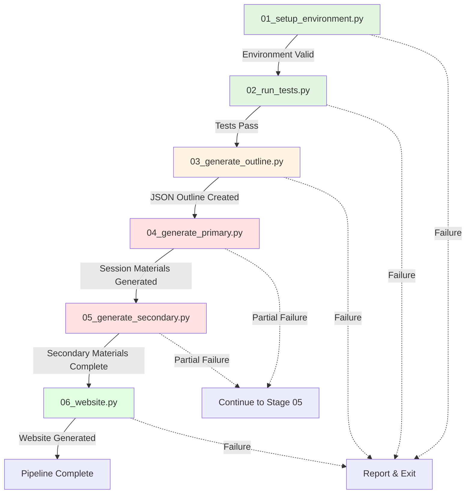
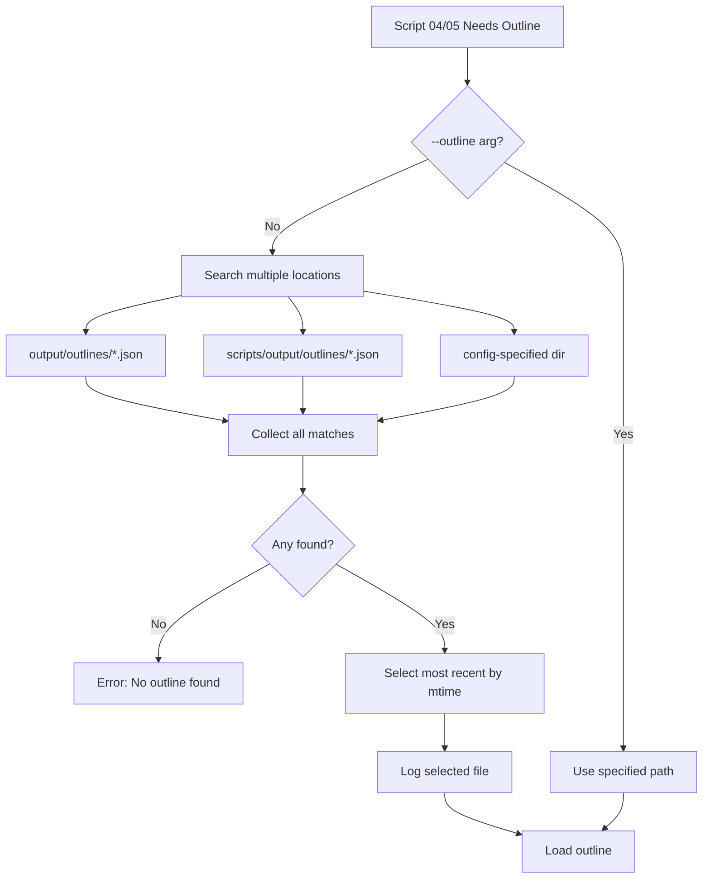

# Pipeline Scripts

Numbered scripts for the educational course Generator pipeline.

## Overview

The pipeline consists of **6 stages** that run sequentially:

1. **Stage 01**: Environment Setup → `01_setup_environment.py`
2. **Stage 02**: Validation & Testing → `02_run_tests.py`
3. **Stage 03**: Outline Generation → `03_generate_outline.py`
4. **Stage 04**: Primary Materials → `04_generate_primary.py`
5. **Stage 05**: Secondary Materials → `05_generate_secondary.py`
6. **Stage 06**: Website Generation → `06_website.py`

**Master Orchestrator**: `run_pipeline.py` (runs all 6 stages)

## Pipeline Flow



## Outline Discovery Algorithm



See [docs/PIPELINE_GUIDE.md](../docs/PIPELINE_GUIDE.md) for pipeline documentation.

## Scripts

### Stage 01: `01_setup_environment.py`

Environment setup and validation with detailed system reporting.

**Usage**:
```bash
# Basic validation
uv run python3 scripts/01_setup_environment.py

# With dependency installation
uv run python3 scripts/01_setup_environment.py --auto-install

# With Ollama auto-start
uv run python3 scripts/01_setup_environment.py --start-ollama

# Verbose mode (debug logging)
uv run python3 scripts/01_setup_environment.py --verbose
```

**What it does**:
- **System Information**: Reports Python version, platform, OS, architecture, disk space
- **Tool Availability**: Checks uv, python3, git, ollama with version reporting
- **Configuration Validation**: Validates all YAML files, reports module count and details
- **Output Structure**: Ensures all output directories exist, counts existing files
- **Ollama Service**: Checks service status, lists all available models, validates configured model
- **Summary Report**: Environment readiness summary

**Arguments**:
- `--auto-install` - Install dependencies with uv
- `--start-ollama` - Attempt to start Ollama if not running
- `--verbose` / `-v` - Enable verbose debug logging
- `--config-dir PATH` - Custom configuration directory

**Example Output**:
```
============================================================
=== educational course GENERATOR - ENVIRONMENT SETUP ===
============================================================

=== System Information ===
  Python Version........... 3.13.10
  Platform................. macOS-26.1-arm64-arm-64bit-Mach-O
  Disk Free................ 107.98 GB
  Disk Usage............... 76.5%

=== Tool Availability ===
  ✓ uv.................. uv 0.9.15
  ✓ python3............. Python 3.13.10
  ✓ git................. git version 2.50.1
  ✓ ollama.............. ollama version is 0.13.0

=== Configuration Validation ===
  Course name: Introductory Biology
  Course modules: 20
    1. Introduction to Biology (4 subtopics)
    2. Chemistry of Life (5 subtopics)
    ...
  LLM Model: gemma3:4b

=== Ollama Service Status ===
  ✓ Ollama service is running
    - gemma3:4b
    - llama3.1:latest
    ...
  Total models available: 14
  ✓ Configured model 'gemma3:4b' is available

============================================================
=== ENVIRONMENT SETUP SUMMARY ===
============================================================
Overall Status: ✓ READY

✓ Environment is ready for content generation
  Next step: uv run python3 scripts/03_generate_outline.py
```

---

### Stage 02: `02_run_tests.py`

Validation and test reporting.

**Usage**:
```bash
# Validation only
uv run python3 scripts/02_run_tests.py

# Validation + modular test suite (runs by default)
uv run python3 scripts/02_run_tests.py

# Verbose test output
uv run python3 scripts/02_run_tests.py --verbose

# Full test suite including integration tests
uv run python3 scripts/02_run_tests.py --include-ollama

# Custom output directory
uv run python3 scripts/02_run_tests.py --output-dir ./my_test_reports
```

**What it does**:
- Validates configuration files using modular imports
- Tests Ollama connectivity
- Runs full pytest suite on modular codebase by default (use `--skip-tests` to skip)
- **Saves complete test output** to timestamped log file
- Parses and reports test statistics (passed, failed, skipped, errors, warnings)
- Extracts and displays warning details (first 10)
- Extracts and displays failure details with traceback excerpts
- Reports per-module test results with status icons
- Calculates and displays pass rate
- Provides helpful troubleshooting tips

**Arguments**:
- `--skip-tests` - Skip pytest tests (validation only)
- `--include-ollama` - Run all tests including integration tests
- `--skip-validation` - Skip validation, only run tests
- `--verbose` / `-v` - Show verbose test output
- `--no-save-output` - Don't save test output to file (saves by default)
- `--output-dir PATH` - Directory for test reports (default: `scripts/test_reports/`)
- `--tests-path PATH` - Path to tests directory (default: `../tests`)
- `--config-dir PATH` - Custom configuration directory

**Output Location**:
- Test reports saved to: `scripts/test_reports/test_results_YYYYMMDD_HHMMSS.log`
- Includes complete pytest output with all warnings and failure details

**Example Output**:
```
======================================================================
Running modular test suite with pytest...
======================================================================
Found 8 test modules in tests
✓ Test output saved to: scripts/test_reports/test_results_20241208_143022.log
----------------------------------------------------------------------
======================================================================
TEST RESULTS BY MODULE
======================================================================
✓ test_config_loader              | Total:  15 | Passed:  15 | Failed:   0 | Skipped:   0
✓ test_llm_client                  | Total:  12 | Passed:  12 | Failed:   0 | Skipped:   0
...
======================================================================
OVERALL TEST SUMMARY
======================================================================
Total Tests:         85
Passed:              85
Failed:               0
Skipped:              0
Errors:               0
Warnings:             2
Duration:           12.34s
Pass Rate:          100.0%
======================================================================
WARNINGS DETAILS
======================================================================
1. DeprecationWarning: ... (example warning)
2. UserWarning: ... (example warning)
======================================================================
✓ ALL TESTS PASSED
  (but 2 warnings detected)
======================================================================
```

---

### Stage 03: `03_generate_outline.py`

Interactive outline generation.

**Usage**:
```bash
# Interactive mode (default)
uv run python3 scripts/03_generate_outline.py

# Non-interactive (use config defaults)
uv run python3 scripts/03_generate_outline.py --no-interactive
```

**What it does**:
- Loads course configuration
- Interactively prompts for course metadata (or uses defaults)
- Generates outline using Ollama
- Saves to `output/outlines/course_outline_TIMESTAMP.md`

**Arguments**:
- `--no-interactive` - Disable interactive prompts, use config defaults
- `--config-dir PATH` - Custom configuration directory
- `--output PATH` - Custom output path for outline

**Modules Used**:
- `src.config_loader.ConfigLoader`
- `src.pipeline.ContentGenerator`
- `src.llm_client.OllamaClient`

---

### Stage 04: `04_generate_primary.py`

Primary materials generation per SESSION (lectures, labs, notes, diagrams, questions).

**Usage**:
```bash
# Generate for all modules (uses latest JSON outline)
uv run python3 scripts/04_generate_primary.py --all

# Generate for specific modules
uv run python3 scripts/04_generate_primary.py --modules 1 2 3

# Use specific outline file
uv run python3 scripts/04_generate_primary.py --all --outline scripts/output/outlines/course_outline_20241208.json

# Override sessions per module
uv run python3 scripts/04_generate_primary.py --all --sessions 3
```

**What it does**:
- Loads module/session structure from JSON outline
- Generates content **per session** (not per module)
- Creates session-based folder structure
- Generates lectures, labs, study notes, diagrams, questions for each session

**Arguments**:
- `--all` - Generate for all modules from outline
- `--modules ID [ID ...]` - Generate for specific module IDs
- `--outline PATH` - Path to specific outline JSON (default: most recent in output/outlines/ or scripts/output/outlines/)
- `--sessions N` - Override number of sessions per module
- `--config-dir PATH` - Custom configuration directory

**Output Structure** (session-based, course-specific):
```
output/{course_name}/modules/module_01_cell_biology/
  session_01/
    lecture.md
    lab.md
    study_notes.md
    diagram_1.mmd
    diagram_2.mmd
    questions.md
  session_02/
    lecture.md
    ...
```

**Note**: Output is saved to course-specific directories: `output/{course_name}/modules/` where `{course_name}` is derived from the outline metadata or default course config.

**Troubleshooting**:
- **Error: "No outline JSON found"** → Run: `uv run python3 scripts/03_generate_outline.py`
- **Error: "Outline file not found"** → Check path with `--outline` parameter
- **Wrong outline being used** → Specify explicit path with `--outline`

---

### Stage 05: `05_generate_secondary.py`

Secondary materials generation per SESSION (synthesizes session context).

**Usage**:
```bash
# Generate all secondary materials for all modules (uses latest JSON outline)
uv run python3 scripts/05_generate_secondary.py --all

# Default behavior (--all is implicit if no args)
uv run python3 scripts/05_generate_secondary.py

# Generate for specific modules
uv run python3 scripts/05_generate_secondary.py --modules 1 2 3

# Generate specific types only
uv run python3 scripts/05_generate_secondary.py --all --types application visualization

# Use specific outline file
uv run python3 scripts/05_generate_secondary.py --outline scripts/output/outlines/course_outline_20241208.json --modules 1

# Dry-run mode (see what would be generated)
uv run python3 scripts/05_generate_secondary.py --all --dry-run

# Validate generated content
uv run python3 scripts/05_generate_secondary.py --all --validate
```

**What it does**:
- Loads module structure from JSON outline
- Reads primary materials from session folders
- Generates 6 secondary material types per session:
  1. `application.md` - Real-world applications and case studies
  2. `extension.md` - Advanced topics beyond core curriculum
  3. `visualization.mmd` - Additional diagrams and concept maps (Mermaid format)
  4. `integration.md` - Cross-module connections and synthesis
  5. `investigation.md` - Research questions and experiments
  6. `open_questions.md` - Current scientific debates and frontiers
- Saves to `output/modules/module_XX/session_YY/[type].md` (or `.mmd` for visualization)

**Arguments**:
- `--all` - Generate for all modules (default if no --modules)
- `--modules ID [ID ...]` - Generate for specific module IDs
- `--types TYPE [TYPE ...]` - Specific types to generate (default: all 6 types)
- `--outline PATH` - Path to specific outline JSON (default: most recent)
- `--validate` - Validate generated content for quality issues
- `--dry-run` - Show what would be generated without calling LLM
- `--config-dir PATH` - Custom configuration directory

**Output Structure** (course-specific):
```
output/{course_name}/modules/module_01_cell_biology/
  session_01/          # Primary materials (from Stage 04)
    lecture.md
    lab.md
    study_notes.md
    diagram_1.mmd
    diagram_2.mmd
    questions.md
    # Secondary materials (from Stage 05, per session):
    application.md
    extension.md
    visualization.mmd
    integration.md
    investigation.md
    open_questions.md
  session_02/
    ...
```

**Note**: Output is saved to course-specific directories: `output/{course_name}/modules/` where `{course_name}` is derived from the outline metadata or default course config.

**Troubleshooting**:
- **Error: "No outline found or outline contains no modules"** → Run: `uv run python3 scripts/03_generate_outline.py`
- **Error: "Outline file not found"** → Check path with `--outline` parameter
- **No modules found with IDs** → Verify module IDs exist in outline JSON
- **Empty primary materials** → Run Stage 04 first to generate primary materials

**Note**: Requires prompt templates in `config/llm_config.yaml` named `secondary_<type>`.

---

### Stage 06: `06_website.py`

Website generation for browsing all course materials.

**Usage**:
```bash
# Generate website (uses latest JSON outline)
uv run python3 scripts/06_website.py

# Use specific outline file
uv run python3 scripts/06_website.py --outline scripts/output/outlines/course_outline_20241208.json

# Custom output path
uv run python3 scripts/06_website.py --output custom/website.html

# Open in browser after generation
uv run python3 scripts/06_website.py --open-browser
```

**What it does**:
- Loads module structure from JSON outline
- Scans output directory for all available content files
- Converts markdown content to HTML
- Generates single self-contained HTML file with embedded CSS and JavaScript
- Includes Mermaid.js for client-side diagram rendering
- Creates intuitive navigation (Module → Session → Content Type)
- Saves to `output/website/index.html`

**Arguments**:
- `--outline PATH` - Path to specific outline JSON (default: most recent)
- `--output PATH` - Custom output path for HTML file (default: `output/website/index.html`)
- `--config-dir PATH` - Custom configuration directory
- `--open-browser` - Open generated website in default browser

**Output**:
- Single HTML file: `output/{course_name}/website/index.html` or `output/website/index.html` (course-specific if course_name available, otherwise default)
- Self-contained (embedded CSS, JavaScript, content)
- Responsive, accessible design
- Mermaid.js integration for diagrams

**Troubleshooting**:
- **Error: "No outline JSON found"** → Run: `uv run python3 scripts/03_generate_outline.py`
- **Error: "No modules found"** → Ensure outline contains modules
- **Missing content** → Run stages 04 and 05 to generate content first

---

### Master Pipeline: `run_pipeline.py`

Execute all stages sequentially.

**Usage**:
```bash
# Run all 6 stages
uv run python3 scripts/run_pipeline.py

# Skip specific stages
uv run python3 scripts/run_pipeline.py --skip-setup --skip-validation

# Process only specific modules (stages 04 and 05)
uv run python3 scripts/run_pipeline.py --modules 1 2 3

# Generate specific secondary types (stage 05)
uv run python3 scripts/run_pipeline.py --types application visualization

# Non-interactive outline generation
uv run python3 scripts/run_pipeline.py --no-interactive

# Run pipeline (tests run automatically in stage 02)
uv run python3 scripts/run_pipeline.py

# Use specific language
uv run python3 scripts/run_pipeline.py --no-interactive --language Spanish
```

**Arguments**:
- `--skip-setup` - Skip Stage 01
- `--skip-validation` - Skip Stage 02
- `--skip-outline` - Skip Stage 03
- `--skip-primary` - Skip Stage 04
- `--skip-secondary` - Skip Stage 05
- `--skip-website` - Skip Stage 06
- `--modules ID [ID ...]` - Module selection (for stages 04 and 05)
- `--types TYPE [TYPE ...]` - Secondary types (for stage 05)
- `--config-dir PATH` - Custom configuration directory
- `--no-interactive` - Non-interactive outline (stage 03)
- `--course NAME` - Course template name (e.g., "biology", "chemistry")
- `--language LANGUAGE` - Language for course content (e.g., "English", "Spanish", "French")
- `--run-tests` - (Deprecated - no effect) Tests run automatically in stage 02
- `--log-level LEVEL` - Set logging level (DEBUG, INFO, WARNING, ERROR)

**Process**:
1. **Stage 01**: Setup environment, validate configs
2. **Stage 02**: Validate and test
3. **Stage 03**: Generate course outline
4. **Stage 04**: Generate primary materials
5. **Stage 05**: Generate secondary materials
6. **Stage 06**: Generate website (browse all course materials)

---

## Quick Reference

| Script | Stage | Purpose | Key Output |
|--------|-------|---------|------------|
| `01_setup_environment.py` | 01 | Setup | Environment validated |
| `02_run_tests.py` | 02 | Validation | Tests passed |
| `03_generate_outline.py` | 03 | Outline | `output/{course_name}/outlines/*.{json,md}` |
| `04_generate_primary.py` | 04 | Primary | `output/{course_name}/modules/module_*/session_*/*.md` |
| `05_generate_secondary.py` | 05 | Secondary | `output/{course_name}/modules/module_*/session_*/{application,...}.*` |
| `06_website.py` | 06 | Website | `output/{course_name}/website/index.html` |
| `run_pipeline.py` | 01-06 | All stages | All above |

## Workflow Examples

### Example 1: Full Automation
```bash
uv run python3 scripts/run_pipeline.py
```

### Example 2: Manual Control (Stage by Stage)
```bash
uv run python3 scripts/01_setup_environment.py
uv run python3 scripts/02_run_tests.py
uv run python3 scripts/03_generate_outline.py
# Review outline...
uv run python3 scripts/04_generate_primary.py --modules 1 2 3
# Review primary materials...
uv run python3 scripts/05_generate_secondary.py --modules 1 --types application visualization
```

### Example 3: Skip Setup and Validation
```bash
uv run python3 scripts/run_pipeline.py --skip-setup --skip-validation
```

### Example 4: Regenerate Specific Modules
```bash
uv run python3 scripts/run_pipeline.py --skip-setup --skip-validation --skip-outline --modules 5 6
```

## Requirements

- **Ollama**: Must be running locally with `llama3` model
- **uv**: Package manager (use `uv run` prefix for all commands)
- **Configuration**: Valid YAML files in `config/` directory

## Troubleshooting

**"Ollama connection error"**:
```bash
# Check Ollama status
curl http://localhost:11434/api/version

# Start Ollama
ollama serve

# Or use Stage 01 with --start-ollama
uv run python3 scripts/01_setup_environment.py --start-ollama
```

**"Config file not found"**:
```bash
# Verify config files exist
ls -la config/

# Use custom config directory
uv run python3 scripts/run_pipeline.py --config-dir /path/to/config
```

**"ModuleNotFoundError: No module named 'src'"**:

All scripts now include automatic sys.path manipulation for direct execution:
```python
_script_dir = Path(__file__).resolve().parent
_project_root = _script_dir.parent
if str(_project_root) not in sys.path:
    sys.path.insert(0, str(_project_root))
```

This allows scripts to be run directly from any location without import errors. If creating new scripts, include this pattern at the top.

**"Module generation failed"**:
```bash
# Regenerate specific module
uv run python3 scripts/04_generate_primary.py --modules <module_id>
```

## Documentation

- **Complete Guide**: [docs/PIPELINE_GUIDE.md](../docs/PIPELINE_GUIDE.md)
- **Content Formats**: [docs/FORMATS.md](../docs/FORMATS.md)
- **Configuration**: [docs/CONFIGURATION.md](../docs/CONFIGURATION.md)
- **Architecture**: [docs/ARCHITECTURE.md](../docs/ARCHITECTURE.md)
