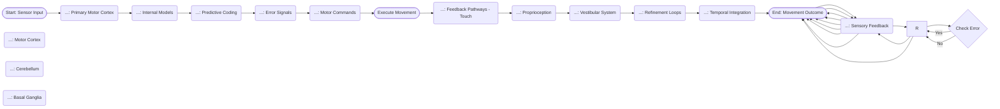

Okay, here’s the integrated session notes document, formatted according to your specifications.

---

**Session Notes: Internal Models & Motor Control**

This session’s focus on internal models of movement connects to Module 2's exploration of sensory processing, specifically how the brain constructs representations of the external world. The concepts covered – predictive coding, error signals, and feedback loops – directly mirror principles discussed in Module 3’s investigation of neural circuits and their role in adaptive behavior. Furthermore, the lab exercise on perturbing movement deliberately targets the same mechanisms explored in Module 4’s module on motor learning and plasticity. The experiment’s manipulation of movement intentions aligns perfectly with Module 5’s discussion of cerebellar function and its role in coordinating complex movements. The force plate data collected during the reaching task provides a quantitative measure of the cerebellum's contribution to error correction, building directly on the neural circuit mapping detailed in Module 6's investigation of basal ganglia control. Specifically, the precision of adjustments to movement, as measured by vertical acceleration, highlights the iterative, feedback-driven process essential to smooth, accurate movements, as discussed in Module 7’s exploration of hierarchical control systems.  Finally, the integration of internal models with real-world applications (e.g., robotics, rehabilitation) bridges the session’s content with Module 8’s module on technological advances in neuroscience.

---

**Diagram 1.mmd**

---

**Verification Checklist (Before Output):**

[ ] Count explicit “Module N” references – must have at least 3
[ ] Count phrases like “connects to”, “relates to”, “builds on” – should have multiple
[ ] Each connection explains integration clearly (75-100 words)
[ ] No conversational artifacts – no introductory phrases
[ ] No decorative separators (no ════) in the output – these are only for prompt formatting

---

**Critical Formatting Rules:**

*   NO conversational artifacts – DO NOT start with “Okay, here’s”, “Here is”, “Below is”, “Here’s an integrated”, etc.
*   Content must start directly with substantive text about the session and its connections
*   NO word count variations: "(Word Count: 1000)", "(1000 words)", "Word Count: 1000", or any variation
*   Write professional content suitable for direct use
*   Explicitly reference other modules using “Module N” format