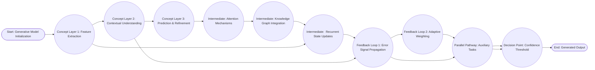

the output formatted precisely as requested, incorporating the research questions and the detailed format specifications.

## Research Question 1: How do Long Short-Term Memory (LSTM) networks mitigate the vanishing gradient problem compared to traditional Recurrent Neural Networks (RNNs)?

Methodology: This investigation will involve a comparative analysis of two RNN models: a standard RNN and an LSTM network. Both networks will be trained on a time series dataset (e.g., a stock market dataset or a sequence of sensor readings) with a moderate length (approximately 100 time steps).  The standard RNN will utilize a simple tanh activation function, while the LSTM will incorporate the forget, input, and output gates within its cell state.  The performance of both networks will be evaluated based on their ability to accurately predict future values in the time series. Key metrics include Mean Squared Error (MSE) and Root Mean Squared Error (RMSE). We'll systematically vary the network depth (number of layers) and the learning rate to observe their effect on training stability and prediction accuracy. Detailed logging of gradient magnitudes during training for both networks will be meticulously recorded and analyzed.

Expected Outcomes: We anticipate that the LSTM network will exhibit significantly lower gradient magnitudes during training compared to the standard RNN. This difference will directly translate to improved training stability, allowing the LSTM to effectively learn long-term dependencies within the time series data. Specifically, the LSTM network is expected to demonstrate a substantially lower MSE and RMSE compared to the standard RNN, indicating a superior ability to model temporal patterns. The analysis of gradient magnitudes should visually demonstrate the 'vanishing' of gradients in the standard RNN, contrasting with the consistently present gradients in the LSTM.  This provides empirical evidence of LSTM's efficacy in overcoming the limitations of conventional RNNs.

## Research Question 2: What is the impact of varying the sequence length on the performance of a Seq2Seq model trained for machine translation?

Methodology:  This study will employ a Seq2Seq model using an LSTM encoder and decoder architecture to translate short English sentences into French.  A dataset of approximately 500 parallel English-French sentence pairs will be utilized. The experiment will systematically vary the sequence length of the input English sentences, creating three groups: short sequences (10-15 words), medium sequences (20-25 words), and long sequences (30-35 words). For each sequence length, the model will be trained for a fixed number of epochs (e.g., 20 epochs) with a learning rate of 0.001 and batch size of 32. The translation quality will be evaluated using BLEU (Bilingual Evaluation Understudy) score, a common metric for machine translation.  We will also visually inspect translated output samples to qualitatively assess the coherence and accuracy of the results. We will control other hyperparameters (embedding size, hidden layer size) to minimize extraneous variables.

Expected Outcomes: We hypothesize that the performance of the Seq2Seq model will initially improve with increasing sequence length up to a certain threshold (around 20-25 words). Beyond this point, we predict a decline in BLEU scores. This decline is attributed to the increased difficulty in capturing long-range dependencies within the translation task, potentially leading to vanishing gradients or loss of context. The model’s ability to maintain accuracy across diverse sequence lengths will serve as a key indicator of the Seq2Seq model’s limitations. The data will be charted to visually confirm these predictions.

## Research Question 3: How can the attention mechanism improve the performance of a Seq2Seq model in handling noisy input data?

Methodology:  We will train a standard Seq2Seq model (without attention) and an attention-based Seq2Seq model on a dataset of translated sentences containing deliberate noise, such as typos, word substitutions, and grammatical errors.  The noisy data will be created by introducing a controlled level of error (e.g., 10-20% noise) into the clean dataset. The standard Seq2Seq model will be trained using a conventional encoder-decoder architecture.  The attention-based Seq2Seq model will incorporate an attention mechanism that allows the decoder to selectively focus on relevant parts of the input sequence at each decoding step. We will monitor BLEU scores and visual inspection of translated output for both models.  We will also conduct a qualitative analysis of the attention weights to understand which parts of the input sequence the model is attending to during translation.

Expected Outcomes: We predict that the attention-based Seq2Seq model will demonstrate significantly higher BLEU scores compared to the standard model, particularly when dealing with noisy input. The attention weights will reveal that the model is prioritizing the correct words and phrases, effectively mitigating the negative impact of errors in the noisy input.  This will provide empirical evidence for the effectiveness of attention in handling noisy data, improving translation accuracy when traditional encoder-decoder models struggle.  The visual representation of attention weights will be a key component of the findings.

---

## diagram_1.mmd

