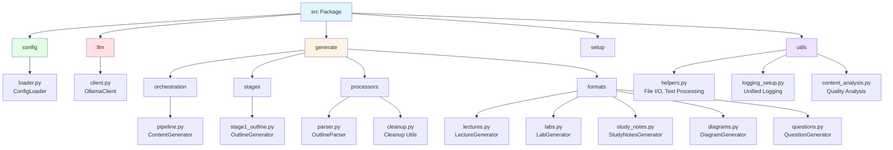
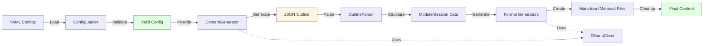
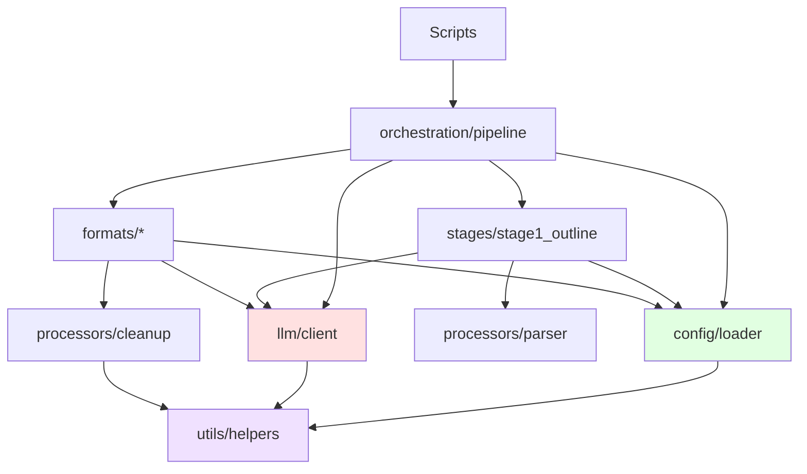

# educational course Modules

Core Python modules for the educational course generator.

## Package Architecture



## Data Flow Through Layers



## Module Dependencies



## Modular Structure

All components are organized into logical subpackages:

### Configuration (`config/`)
- `loader.py` - Configuration loading and validation

### LLM Integration (`llm/`)
- `client.py` - Ollama API integration

### Content Generation (`generate/`)

**Orchestration** (`generate/orchestration/`)
- `pipeline.py` - Workflow orchestration (ContentGenerator)

**Stages** (`generate/stages/`)
- `stage1_outline.py` - Course outline generation (OutlineGenerator)

**Processors** (`generate/processors/`)
- `parser.py` - Outline parsing and processing (OutlineParser)
- `cleanup.py` - Content cleanup and validation utilities

**Formats** (`generate/formats/`)
- `__init__.py` - Base ContentGenerator class
- `lectures.py` - LectureGenerator
- `labs.py` - LabGenerator
- `study_notes.py` - StudyNotesGenerator
- `diagrams.py` - DiagramGenerator
- `questions.py` - QuestionGenerator

### Utilities (`utils/`)
- `helpers.py` - File I/O, text processing, formatting utilities

## Usage

Import using modular paths:

```python
from src.config.loader import ConfigLoader
from src.llm.client import OllamaClient
from src.generate.orchestration.pipeline import ContentGenerator
from src.generate.stages.stage1_outline import OutlineGenerator
from src.generate.processors.parser import OutlineParser
from src.generate.formats.lectures import LectureGenerator
from src.generate.formats.labs import LabGenerator
from src.generate.formats.study_notes import StudyNotesGenerator
from src.generate.formats.diagrams import DiagramGenerator
from src.generate.formats.questions import QuestionGenerator
from src.utils.helpers import ensure_directory, slugify, save_markdown
```

All modules follow best practices with comprehensive logging, error handling, and type hints.
