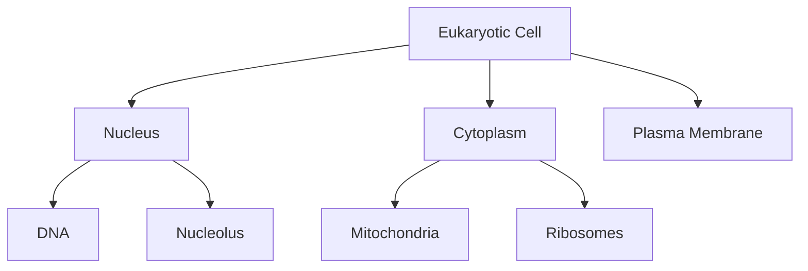

# Format Generators Module

Content generators for all course material formats.

## Module Purpose

Provides specialized generator classes for each content format: lectures, labs, study notes, diagrams, and questions. All inherit from `ContentGenerator` base class and use LLM with format-specific prompts.

## Base Class: ContentGenerator

```python
from src.generate.formats import ContentGenerator
```

Base class for all format-specific generators.

### Attributes

```python
class ContentGenerator:
    def __init__(self, config_loader, llm_client):
        self.config_loader = config_loader  # ConfigLoader instance
        self.llm_client = llm_client        # OllamaClient instance
```

All generators inherit these attributes for accessing configuration and LLM.

## LectureGenerator

```python
from src.generate.formats.lectures import LectureGenerator
```

Generates comprehensive lecture content (2000-4000 words).

### Usage

```python
lecture_gen = LectureGenerator(config_loader, llm_client)

module_info = {
    "name": "Cell Biology",
    "subtopics": ["Cell structure", "Organelles"],
    "learning_objectives": ["Understand cell structure"],
    "content_length": 2500
}

# Generate lecture
lecture = lecture_gen.generate_lecture(module_info)

# Save lecture (session-based structure)
session_dir = Path("output/modules/module_01_cell_biology/session_01")
session_dir.mkdir(parents=True, exist_ok=True)
path = lecture_gen.save_lecture(lecture, module_info, session_dir)
# Saves to: output/modules/module_01_cell_biology/session_01/lecture.md
```

### Output Format

```markdown
# Cell Biology - Lecture

## Introduction
[Overview of cell biology...]

## Cell Structure
[Detailed content...]

## Organelles
[Detailed content...]

## Summary
[Key takeaways...]
```

## LabGenerator

```python
from src.generate.formats.labs import LabGenerator
```

Generates laboratory exercises with procedures and safety notes.

### Usage

```python
lab_gen = LabGenerator(config_loader, llm_client)

# Generate single lab
lab = lab_gen.generate_lab(
    module_info,
    lab_number=1,
    lecture_context="Lecture summary..."
)

# Generate multiple labs
labs = lab_gen.generate_labs(
    module_info,
    num_labs=2,
    lecture_context="Lecture summary..."
)
# Returns: ["Lab 1 content", "Lab 2 content"]

# Save labs (session-based structure)
session_dir = Path("output/modules/module_01_cell_biology/session_01")
session_dir.mkdir(parents=True, exist_ok=True)
path = lab_gen.save_lab(lab, module_info, lab_number=1, output_dir=session_dir)
# Saves to: output/modules/module_01_cell_biology/session_01/lab.md
```

### Output Format

```markdown
# Cell Biology - Laboratory Exercise 1

## Lab Focus: Cell structure

## Objectives
- Observe cell structure
- Identify organelles

---

## Materials
- Microscope
- Prepared slides

## Safety Notes
⚠️ Handle glass slides carefully

## Procedure
1. Set up microscope
2. Observe slide
3. Record observations

## Expected Results
[Description...]

## Questions
1. What structures did you observe?
2. How do organelles differ?
```

## StudyNotesGenerator

```python
from src.generate.formats.study_notes import StudyNotesGenerator
```

Generates concise review summaries.

### Usage

```python
notes_gen = StudyNotesGenerator(config_loader, llm_client)

# Generate study notes
notes = notes_gen.generate_study_notes(
    module_info,
    lecture_context="Lecture summary...",
    lab_context="Lab summary..."
)

# Save notes (session-based structure)
session_dir = Path("output/modules/module_01_cell_biology/session_01")
session_dir.mkdir(parents=True, exist_ok=True)
path = notes_gen.save_study_notes(notes, module_info, session_dir)
# Saves to: output/modules/module_01_cell_biology/session_01/study_notes.md
```

### Output Format

```markdown
# Cell Biology - Study Notes

## Key Concepts

### Cell Structure
- Plasma membrane encloses cell
- Cytoplasm contains organelles

### Organelles
- Nucleus: genetic control
- Mitochondria: energy production

## Important Terms
- **Organelle**: Specialized cell structure
- **Cytoplasm**: Cell interior fluid

## Review Questions
1. What is the function of the nucleus?
2. Describe the plasma membrane.
```

## DiagramGenerator

```python
from src.generate.formats.diagrams import DiagramGenerator
```

Generates Mermaid diagrams for visual concepts.

### Usage

```python
diagram_gen = DiagramGenerator(config_loader, llm_client)

# Generate single diagram
diagram = diagram_gen.generate_diagram(
    topic="Cell Structure",
    context="Show major organelles and their locations"
)

# Generate multiple diagrams
diagrams = diagram_gen.generate_diagrams(
    module_info,
    num_diagrams=3
)
# Returns: ["Diagram 1 mermaid", "Diagram 2 mermaid", "Diagram 3 mermaid"]

# Save diagrams (session-based structure)
session_dir = Path("output/modules/module_01_cell_biology/session_01")
session_dir.mkdir(parents=True, exist_ok=True)
for i, diagram in enumerate(diagrams, 1):
    topic = module_info["subtopics"][i-1] if i <= len(subtopics) else "Overview"
    path = diagram_gen.save_diagram(
        diagram, topic, module_info["id"], i, session_dir
    )
    # Saves to: output/modules/module_01_cell_biology/session_01/diagram_1.mmd
```

### Output Format (Mermaid)



## QuestionGenerator

```python
from src.generate.formats.questions import QuestionGenerator
```

Generates comprehension questions (multiple choice, short answer, essay).

### Usage

```python
question_gen = QuestionGenerator(config_loader, llm_client)

module_info["num_questions"] = 15

# Generate questions
questions = question_gen.generate_questions(
    module_info,
    lecture_context="Lecture summary...",
    lab_context="Lab summary..."
)

# Save questions (session-based structure)
session_dir = Path("output/modules/module_01_cell_biology/session_01")
session_dir.mkdir(parents=True, exist_ok=True)
path = question_gen.save_questions(questions, module_info, session_dir)
# Saves to: output/modules/module_01_cell_biology/session_01/questions.md
```

### Output Format

```markdown
# Cell Biology - Comprehension Questions

**Total Questions**: 15  
**Multiple Choice**: 7 | **Short Answer**: 5 | **Essay**: 3

## Multiple Choice Questions

1. What structure controls the cell's activities?
   a) Mitochondria
   b) Nucleus ✓
   c) Ribosome
   d) Lysosome

## Short Answer Questions

1. Describe the function of mitochondria.
   **Answer**: Mitochondria produce ATP through cellular respiration...

## Essay Questions

1. Compare and contrast prokaryotic and eukaryotic cells.
   **Rubric**: 
   - Cell structure (30%)
   - Organelles (40%)
   - Examples (30%)
```

## Common Patterns

### Generate All Formats for Module

```python
from src.config.loader import ConfigLoader
from src.llm.client import OllamaClient
from src.generate.formats.lectures import LectureGenerator
from src.generate.formats.labs import LabGenerator
from src.generate.formats.study_notes import StudyNotesGenerator
from src.generate.formats.diagrams import DiagramGenerator
from src.generate.formats.questions import QuestionGenerator

# Setup
loader = ConfigLoader("config")
llm_client = OllamaClient(loader.get_llm_parameters())

# Create generators
lecture_gen = LectureGenerator(loader, llm_client)
lab_gen = LabGenerator(loader, llm_client)
notes_gen = StudyNotesGenerator(loader, llm_client)
diagram_gen = DiagramGenerator(loader, llm_client)
question_gen = QuestionGenerator(loader, llm_client)

# Get module info
module = loader.get_module_by_id(1)

# Generate all formats
lecture = lecture_gen.generate_lecture(module)
labs = lab_gen.generate_labs(module, num_labs=2, lecture_context=lecture)
notes = notes_gen.generate_study_notes(module, lecture, labs[0] if labs else "")
diagrams = diagram_gen.generate_diagrams(module, num_diagrams=3)
questions = question_gen.generate_questions(module, lecture, labs[0] if labs else "")

# Save all (session-based structure)
session_dir = Path("output/modules/module_01_cell_biology/session_01")
session_dir.mkdir(parents=True, exist_ok=True)
lecture_gen.save_lecture(lecture, module, session_dir)
lab_gen.save_lab(labs[0] if labs else "", module, lab_number=1, output_dir=session_dir)
notes_gen.save_study_notes(notes, module, session_dir)
for i, diagram in enumerate(diagrams, 1):
    diagram_gen.save_diagram(diagram, module["subtopics"][i-1] if i <= len(module.get("subtopics", [])) else "Overview", module["id"], i, session_dir)
question_gen.save_questions(questions, module, session_dir)
```

### Custom Generator

```python
from src.generate.formats import ContentGenerator

class CustomGenerator(ContentGenerator):
    """Custom content generator."""
    
    def generate_custom(self, module_info):
        # Get custom prompt template
        prompt = self.config_loader.get_prompt_template("custom_type")
        
        variables = {
            "module_name": module_info["name"],
            "topic": module_info["subtopics"][0]
        }
        
        content = self.llm_client.generate_with_template(
            prompt["template"],
            variables,
            system_prompt=prompt["system"]
        )
        
        return content

# Use custom generator
custom_gen = CustomGenerator(loader, llm_client)
content = custom_gen.generate_custom(module_info)
```

## Testing

Tests in `tests/test_content_generators.py` and `tests/test_new_generators.py`:
- Lecture generation
- Lab generation (single and multiple)
- Study notes generation
- Diagram generation
- Question generation
- File saving

**Requires Ollama + gemma3:4b model**

Run tests:
```bash
uv run pytest tests/test_content_generators.py tests/test_new_generators.py -v
```

## Generator Method Signatures

### Base Class: ContentGenerator

```python
class ContentGenerator:
    def __init__(
        self, 
        config_loader: ConfigLoader, 
        llm_client: OllamaClient
    ) -> None
```

### LectureGenerator

```python
class LectureGenerator(ContentGenerator):
    def generate_lecture(self, module_info: Dict[str, Any]) -> str
    def save_lecture(
        self, 
        lecture: str, 
        module_info: Dict[str, Any], 
        output_dir: str
    ) -> Path
```

### LabGenerator

```python
class LabGenerator(ContentGenerator):
    def generate_lab(
        self,
        module_info: Dict[str, Any],
        lab_number: int,
        lecture_context: str = ""
    ) -> str
    
    def generate_labs(
        self,
        module_info: Dict[str, Any],
        num_labs: int,
        lecture_context: str = ""
    ) -> List[str]
    
    def save_lab(
        self,
        lab: str,
        module_info: Dict[str, Any],
        lab_number: int,
        output_dir: str
    ) -> Path
```

### StudyNotesGenerator

```python
class StudyNotesGenerator(ContentGenerator):
    def generate_study_notes(
        self,
        module_info: Dict[str, Any],
        lecture_context: str = "",
        lab_context: str = ""
    ) -> str
    
    def save_study_notes(
        self,
        notes: str,
        module_info: Dict[str, Any],
        output_dir: str
    ) -> Path
```

### DiagramGenerator

```python
class DiagramGenerator(ContentGenerator):
    def generate_diagram(
        self,
        topic: str,
        context: str = ""
    ) -> str
    
    def generate_diagrams(
        self,
        module_info: Dict[str, Any],
        num_diagrams: int
    ) -> List[str]
    
    def save_diagram(
        self,
        diagram: str,
        topic: str,
        module_id: int,
        diagram_number: int,
        output_dir: str
    ) -> Path
```

### QuestionGenerator

```python
class QuestionGenerator(ContentGenerator):
    def generate_questions(
        self,
        module_info: Dict[str, Any],
        lecture_context: str = "",
        lab_context: str = ""
    ) -> str
    
    def save_questions(
        self,
        questions: str,
        module_info: Dict[str, Any],
        output_dir: str
    ) -> Path
```

## Content Validation

All generated content is automatically validated with quality checks:

- **Length validation**: Content meets minimum word counts
- **Structure validation**: Required sections present
- **Format validation**: Markdown syntax correct
- **Completeness**: All required elements included

**Status indicators**:
- `[COMPLIANT]` - Content meets all quality standards
- `[NEEDS REVIEW]` - Content may need manual review

## See Also

- **For Humans**: [README.md](README.md) - Human-readable guide with examples
- **Format Specifications**: [../../../docs/FORMATS.md](../../../docs/FORMATS.md) - Detailed format docs
- **Pipeline**: [../orchestration/AGENTS.md](../orchestration/AGENTS.md) - Workflow coordination
- **Configuration**: [../../config/AGENTS.md](../../config/AGENTS.md) - Prompt templates
- **Test Files**: [../../../tests/test_content_generators.py](../../../tests/test_content_generators.py), [../../../tests/test_new_generators.py](../../../tests/test_new_generators.py) - Generator tests


