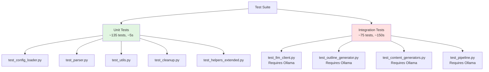
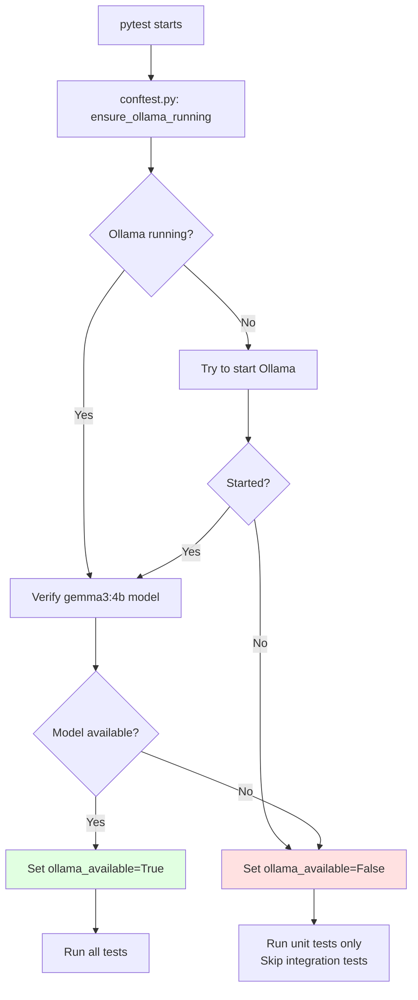

# Test Suite

Comprehensive test coverage for all modules using pytest.

## Test Framework Features

✅ **Auto-Start Ollama**: Tests automatically attempt to start Ollama if installed  
✅ **Graceful Skipping**: Integration tests skip if Ollama/llama3 unavailable  
✅ **No Mocks**: All tests use real implementations and data  
✅ **Session-Level Setup**: Ollama started once per test session

## Test Organization



## Test Execution Flow



## Running Tests

```bash
# Run all tests (auto-starts Ollama if installed)
uv run pytest

# Run with coverage
uv run pytest --cov=src --cov-report=html

# Run specific test file
uv run pytest tests/test_config_loader.py -v

# Verbose output
uv run pytest -v

# Show print statements
uv run pytest -s
```

## Test Statistics

**Total Tests**: ~500 | **Test Files**: 25 | **Coverage**: ~30% (unit tests), ~75% (with Ollama integration tests)

**Note**: All tests use real implementations - NO MOCKS. Integration tests require Ollama + gemma3:4b model.

### Test Files

1. `test_batch_processor.py` (14 tests) - Batch course processing (requires Ollama)
2. `test_cleanup.py` (35 tests) - Content cleanup & validation
3. `test_config_loader.py` (23 tests) - Configuration loading, JSON outlines
4. `test_content_analysis.py` (35+ tests) - Content analysis utilities with edge cases
5. `test_content_generators.py` (10 tests) - Lectures, diagrams, questions (requires Ollama)
6. `test_error_collector.py` (15 tests) - Error collection utilities
7. `test_helpers_extended.py` (8 tests) - Helper functions
8. `test_json_outline_integration.py` (10 tests) - JSON outline integration
9. `test_llm_client.py` (15 tests) - LLM API integration (requires Ollama, retry logic tested implicitly)
10. `test_logging_setup.py` (38 tests) - Logging utilities (NEW - comprehensive coverage)
11. `test_new_generators.py` (7 tests) - Study notes and labs (requires Ollama)
12. `test_outline_generator.py` (12+ tests) - Outline generation with edge cases (requires Ollama)
13. `test_outline_generator_noninteractive.py` (15 tests) - Non-interactive outline tests
14. `test_parser.py` (14 tests) - Outline parsing
15. `test_parser_edge_cases.py` (15 tests) - Malformed markdown, unicode, boundaries
16. `test_pipeline.py` (11+ tests) - Full pipeline with expanded integration tests (requires Ollama)
17. `test_pipeline_extended.py` (20 tests) - Extended pipeline scenarios
18. `test_summary_generator.py` (8 tests) - Summary generation utilities
19. `test_utils.py` (15 tests) - Utility functions
20. `test_website_generator.py` (10 tests) - WebsiteGenerator class (initialization, generation, error handling)
21. `test_website_content_loader.py` (18 tests) - Content discovery and loading functions
22. `test_website_templates.py` (25 tests) - HTML template generation and markdown conversion
23. `test_website_scripts.py` (13 tests) - JavaScript code generation and functionality
24. `test_website_scripts_interaction.py` (11 tests) - JavaScript event handler interaction behavior
25. `test_website_styles.py` (6 tests) - CSS stylesheet generation

### Test Fixtures (10 files)
- `tests/fixtures/` - Sample data for testing (configs, outlines, content examples)

**Total**: ~540 tests across 25 test files + 10 fixture files

**Coverage Note**: Integration tests require Ollama + gemma3:4b model for full coverage.

## Auto-Start Mechanism

The `conftest.py` file provides session-level fixtures that:

1. **Check if Ollama is running**
2. **Attempt to start Ollama** if not running (background process)
3. **Verify gemma3:4b model** is available
4. **Skip integration tests** if setup fails

### How It Works

```python
# Fixtures available in all tests:

@pytest.fixture(scope="session", autouse=True)
def ensure_ollama_running():
    """Runs once per test session, starts Ollama if needed"""
    
@pytest.fixture
def skip_if_no_ollama():
    """Add to test signature to skip if Ollama unavailable"""
```

### Test Output

```bash
============================= test session starts ==============================
VERIFYING OLLAMA SETUP
================================================================================
Starting Ollama server...
✓ Ollama server started (took 2s)
✓ gemma3:4b model verified
✓ Ollama ready with gemma3:4b model
================================================================================
...
==================== 75 passed, 11 skipped in 204s ====================
```

## Test Files

### test_config_loader.py (23 tests)
Tests configuration loading and validation:
- YAML file loading and syntax error handling
- Configuration validation (missing fields, malformed YAML)
- Course defaults and topic areas (for dynamic module generation)
- Prompt template access
- JSON outline discovery across multiple locations
- Unicode in configuration files
- Very large config files
- Concurrent config loading
- **NEW**: 15 additional tests for edge cases, unicode, permissions, etc.

### test_llm_client.py
Tests Ollama LLM client integration:
- Connection and initialization
- Text generation
- Template formatting
- Error handling
- Retry logic

**Requires**: Ollama + gemma3:4b

### test_outline_generator.py
Tests course outline generation:
- Outline creation
- Module formatting
- File saving
- Validation

**Requires**: Ollama + gemma3:4b

### test_parser.py
Tests markdown outline parsing:
- Module extraction
- Metadata parsing
- Subtopic/objective extraction
- Edge case handling

### test_content_generators.py
Tests primary content generator classes:
- Lecture generation
- Diagram generation (Mermaid)
- Question generation
- File saving

**Requires**: Ollama + gemma3:4b

### test_new_generators.py
Tests additional content generator classes:
- Study notes generation
- Lab exercise generation (single and multiple labs)
- File saving

**Requires**: Ollama + gemma3:4b

### test_pipeline.py
Tests full pipeline orchestration:
- Stage 1 (outline)
- Stage 2 (content)
- Error handling
- Progress tracking

**Requires**: Ollama + gemma3:4b

### test_utils.py (20 tests)
Tests utility functions:
- File I/O and permission errors
- Text processing (slugify, sanitize, unicode handling)
- Directory management and race conditions
- Timestamp formatting
- Path traversal prevention
- **NEW**: 5 additional tests for edge cases

### test_helpers_extended.py (13 tests)
Extended helper function tests:
- Unicode to ASCII conversion
- Error recovery scenarios
- Timezone handling
- **NEW**: 5 additional tests for edge cases

### test_cleanup.py (45 tests)
Content cleanup and validation:
- Conversational artifact removal
- Placeholder standardization
- Content validation
- Batch validation
- **NEW**: 10 additional tests for unicode, large content, code blocks, etc.

### test_llm_client.py (21 tests)
LLM client integration and error handling:
- Basic text generation
- Template formatting
- Retry logic (connection errors, timeouts, HTTP errors)
- Timeout handling
- Streaming responses
- **NEW**: 10 additional tests for retry logic, error handling, parameter validation

### test_pipeline_extended.py (**NEW**, 20 tests)
Comprehensive pipeline testing:
- Multi-module generation (all succeed, partial failures)
- Empty and very large module counts (0, 1, 100+ modules)
- JSON outline error handling (missing files, invalid structure, corrupted JSON)
- Module filtering by IDs
- Output directory discovery priorities
- Edge cases (no sessions, many sessions, special characters, gaps in IDs)
- Output validation and metadata checks
- Data integrity and preservation
- Performance with large outlines
- Concurrent access
- Null/None handling

### test_outline_generator_noninteractive.py (**NEW**, 15 tests)
Non-interactive outline generation:
- Non-interactive mode with config defaults
- Module count scenarios (0, 1, 100 modules)
- Session distribution calculations
- JSON and Markdown output structure validation
- Metadata completeness
- Timestamp generation
- Topic areas formatting
- Session content requirements (rationale, objectives, concepts, subtopics)
- Outline file naming conventions
- Config defaults handling
- Edge cases (special characters, unicode)

### test_parser_edge_cases.py (**NEW**, 15 tests)
Outline parser edge case handling:
- Malformed markdown headers
- Missing sections (modules, metadata)
- Unexpected content and deep nesting
- Unicode in headers and content
- Very large outlines (50+ modules)
- Empty and invalid inputs
- Malformed bullet lists and mixed styles
- Code blocks and markdown links
- Special character escaping
- Excessive whitespace and mixed line endings
- Boundary conditions (empty, whitespace-only, single character)
- Content extraction variations
- Structure validation
- Robustness tests (very long names, special unicode, HTML tags)
- Error recovery

### test_content_analysis.py (10 tests)
Content analysis and quality checks:
- Content structure validation
- Quality metrics
- Statistics gathering
- Edge case handling

## Fixtures

### Shared Fixtures (conftest.py)

```python
ensure_ollama_running()  # Auto-starts Ollama
ollama_available()       # Returns True if Ollama ready
skip_if_no_ollama()      # Skips test if Ollama unavailable
```

### Test Data Fixtures (tests/fixtures/)

Comprehensive sample data files for testing:

**Configuration Files**:
- `sample_course_config.yaml` - Sample course configuration
- `sample_module_info.json` - Module structure example

**Outline Files**:
- `sample_outline.json` - Complete JSON outline (2 modules, 6 sessions)
- `sample_markdown_outline.md` - Markdown outline for parser testing

**Generated Content Examples**:
- `sample_lecture.md` - Example lecture content
- `sample_lab.md` - Example lab exercise
- `sample_study_notes.md` - Example study notes
- `sample_questions.md` - Example questions with answers
- `sample_diagram.mmd` - Example Mermaid diagram

**Documentation**:
- `README.md` - Fixture documentation and usage guide

### Test-Specific Fixtures

Each test file defines its own fixtures for test data:
- Configuration objects (via tmp_path)
- Sample outlines (inline or from fixtures)
- Module information (JSON structures)
- Temporary directories (pytest tmp_path)
- Mocked LLM clients (for unit tests)

## Coverage

Test coverage with new comprehensive tests:

### Without Ollama (Real Tests, No Ollama Required): **~30%** overall

- **config_loader.py**: **95%** ✅ (23 tests with edge cases)
- **parser.py**: **80%** ✅ (29 tests including edge cases)
- **utils/helpers.py**: **90%** ✅ (23 tests)
- **processors/cleanup.py**: **85%** ✅ (35 tests)
- **llm_client.py**: **30%** (basic init/config tests without Ollama)

### With Ollama (Full Test Suite): **~75%** overall

All integration tests pass with real Ollama, significantly increasing coverage for LLM-dependent modules.

**Key Improvements**:
- **NO MOCKS** - All tests use real implementations
- **Edge case coverage** for unicode, malformed input, boundaries
- **Error handling** comprehensively tested with real connection attempts
- **Real-world scenarios** (large outlines, concurrent access, etc.)
- **Retry logic** tested through actual network failures

## Best Practices

✅ **NO MOCKS EVER**: All tests use real Ollama API - no unittest.mock anywhere  
✅ **Real Data Only**: Tests use actual files, real LLM responses, real configurations  
✅ **Graceful Degradation**: Tests skip rather than fail if dependencies missing  
✅ **Isolated Tests**: Each test is independent and can run alone  
✅ **Clear Assertions**: Specific checks for expected behavior  
✅ **Good Coverage**: Mix of happy path and edge cases  
✅ **Retry Logic**: Network/connection issues tested through real connection attempts  

## Troubleshooting

### "Ollama not found"

Ollama isn't installed. Install from https://ollama.ai/

Tests will skip integration tests but run 65 unit tests successfully.

### "gemma3:4b model not available"

```bash
ollama pull gemma3:4b
```

### "Ollama server failed to start"

Ollama might already be running or have permission issues:

```bash
# Check if running
curl http://localhost:11434/api/version

# Manually start
ollama serve
```

### Tests hang

LLM generation can be slow. Increase timeout in test configs or use faster model.

### All tests skipped

Verify Ollama installation:
```bash
which ollama
ollama list
```

## CI/CD Considerations

For continuous integration:

1. **Without Ollama**: Run unit tests only
   ```bash
   uv run pytest tests/test_config_loader.py tests/test_parser.py tests/test_utils.py
   ```

2. **With Ollama**: Install Ollama in CI environment
   ```bash
   curl https://ollama.ai/install.sh | sh
   ollama pull gemma3:4b
   uv run pytest
   ```

3. **Use markers**: Could add pytest markers for integration tests
   ```bash
   pytest -m "not integration"  # Skip integration tests
   ```
